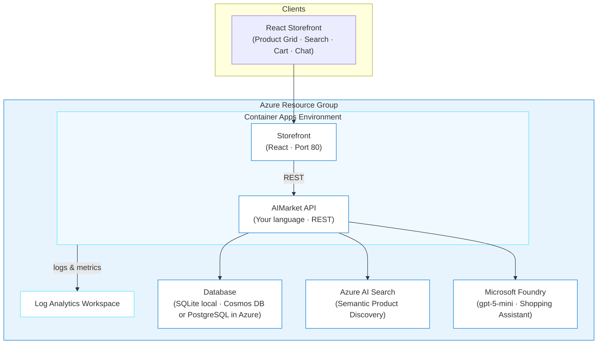

# AIMarket

> ✨ **Build a full-stack marketplace from a spec document, with AI features from search to checkout.**

<p align="center">
  
</p>

In this agentic journey, you'll build AIMarket, a lightweight marketplace app with AI-powered product search and a shopping assistant. You'll hand GitHub Copilot a spec document and watch it scaffold an API in your chosen language, generate a React storefront, add AI features, and deploy the whole thing to Azure.

## Learning Objectives

- Use a spec/plan document as shared context for GitHub Copilot to scaffold an entire application
- Build a REST API with products, orders, and users in your choice of language (Node.js, Python, .NET, or Java)
- Build a React storefront that consumes the API
- Add semantic product search with Azure AI Search
- Build an AI shopping assistant with Microsoft Foundry
- Deploy the full stack to Azure Container Apps using `azd`

> ⏱️ **Estimated Time**: ~2-3 hours (includes building, testing, and deploying all 4 phases)
>
> 💰 **Estimated Cost**: ~$100-115/month (AI Search Basic tier is the main cost; see [Cost Breakdown](#cost-breakdown)). **Clean up with `azd down` when done!**
>
> 📋 **Prerequisites**: See [prerequisites](../../README.md#prerequisites) for standard installation links.
>
> **Additional prerequisites for this journey:**
> - [Docker](https://docs.docker.com/get-docker/): needed for image builds in Phase 4
> - [GitHub CLI](https://cli.github.com/) (`gh`): needed for repo creation and issue management in Phases 2-3
> - Your language runtime: Node.js LTS, Python 3.10+, .NET 8+, or Java 17+

---

## Architecture



**Azure resources created:**

- **Azure Container Apps**: Serverless hosting for the API and frontend
- **Database**: SQLite embedded (default). Swappable to Cosmos DB or PostgreSQL via `DATA_PROVIDER` env var
- **Azure AI Search** (Basic tier): Semantic product discovery
- **Microsoft Foundry** (AIServices): gpt-5-mini shopping assistant
- **Azure Container Registry**: Docker image storage
- **Azure Log Analytics**: Monitoring and diagnostics

---

## The Spec

AIMarket is driven by a spec document: [`PLAN.md`](./PLAN.md) in this journey folder. It defines the data models, API contracts, validation rules, and seed data. You don't need to read the whole thing. Copilot CLI reads it for you and generates code that matches.

**Core data model (the parts you'll build):**

| Entity | Key Fields | Purpose |
|--------|-----------|---------|
| **Product** | id, name, description, price, category, tags, inventory, rating | Marketplace catalog |
| **Order** | id, userId, items[], total, status (pending → confirmed → shipped → delivered) | Purchase tracking |
| **User** | id, email, name, role (buyer/seller) | Account management |

**API endpoints you'll generate:**

| Method | Path | Description |
|--------|------|-------------|
| `GET` | `/api/products` | List products with pagination and filtering |
| `GET` | `/api/products/:id` | Get a single product |
| `POST` | `/api/products` | Create a product (sellers) |
| `POST` | `/api/products/search` | AI-powered semantic search |
| `POST` | `/api/orders` | Place an order |
| `GET` | `/api/orders/:id` | Get order details |
| `POST` | `/api/users/register` | Register a new user |
| `POST` | `/api/chat` | AI shopping assistant |

---

## The Journey

AIMarket is built in four phases. Each phase uses a different agentic AI workflow: interactive prompting, code review, delegation, and deployment. The [`PLAN.md`](./PLAN.md) spec is your shared context throughout.

**How this journey works:** You won't paste one giant prompt and get a finished app. Instead, you'll build incrementally: ask Copilot CLI for a piece, inspect what it generated, test it, fix issues, and then move on. This is how developers actually work with AI: generate → inspect → test → refine.

> **💡 Tip: Track issues as you go.** When giving Copilot CLI a prompt, add *"If you encounter any issues, log them to issues.md so they can be tracked and fixed."* This gives Copilot CLI a place to record problems it finds or fixes during generation, making it easier to iterate and debug.

### Phase 1: Build the API from the Spec (~25 min)

<p align="center">
  
</p>

You'll build the API in stages, not all at once. Each step teaches a different aspect of working with Copilot CLI.

#### Step 1: Set up the project

Create a new directory and copy the spec into it:

```bash
mkdir ~/aimarket && cd ~/aimarket
cp /path/to/github-azure-agentic-journeys/journeys/aimarket/PLAN.md .
```

Start Copilot CLI:

```bash
copilot
```

Once inside the interactive session, add the marketplace (first time only):

> **Note:** Lines starting with `>` in the code blocks below show what to type in the Copilot CLI session. Don't include the `>` character itself.

```
> /plugin marketplace add microsoft/azure-skills
```

Then install the plugin:

```
> /plugin install azure@azure-skills
```

> **Already installed?** The plugin persists across sessions. If you've done a previous journey, skip the install commands.
> For more details, see the [azure-skills repository](https://github.com/microsoft/azure-skills).

#### Step 2: Generate the data models

Start with just the data models, not the whole API. This lets you inspect what Copilot CLI produces before building on top of it.

> **Pick your language here.** The prompts below say `[YOUR LANGUAGE]`. Replace with your choice: Node.js/Express with TypeScript, Python/FastAPI, .NET Minimal APIs with C#, or Java/Spring Boot. See the "Choose Your Stack" table in PLAN.md for framework and library recommendations.

```
> Read the PLAN.md file in this directory. Create a [YOUR LANGUAGE] project 
  in an api/ subdirectory. Initialize the project with the standard build files.
  Then create just the data models from the Phase 1 spec: Product, Order 
  (with OrderItem and ShippingAddress), and User. Include validation functions 
  for each model. Use the recommended framework from the Choose Your Stack 
  table in the spec.
```

**🔍 Inspect what was generated:**

Open the Product model file. Look for:
- Does the `Product` type match the PLAN.md fields? (id, name, description, price, category, tags, etc.)
- Does validation check that `price > 0` and `category` is from the allowed list?
- Are the constraints right? (name 1-200 chars, inventory >= 0)

If anything's off, tell Copilot CLI:

```
> The Product validation doesn't check that category is one of the allowed 
  values from the spec. Fix it to reject invalid categories.
```

**💡 What you're learning:** Copilot CLI reads your spec and generates types + validation, but you still need to verify it matched, especially constraints and edge cases. It usually gets the shape right but always double-check.

#### Step 3: Generate the data layer with repository pattern

Now add the database layer. The spec calls for a repository pattern so you can swap SQLite for Cosmos DB later without changing route code.

```
> Read the Data Access Layer section in PLAN.md. Create the repository pattern 
  for [YOUR LANGUAGE]:
  1. Repository interfaces/protocols for Product, Order, and User
  2. SQLite implementation using the recommended library from the Choose Your Stack table
  3. A factory that reads DATA_PROVIDER env var (default: sqlite)
  4. Seed data from the PLAN.md tables with exact IDs
  Store tags as JSON strings in SQLite and parse them on read.
```

**🔍 Inspect what was generated:**

Open the SQLite implementation file and look for:
- **Tags storage:** SQLite has no array type. The spec says to store tags as JSON strings (`'["laptop","ultrabook"]'`) and parse them on read. Did Copilot CLI do this?
- **Order items:** Are they in a junction table (`order_items`) or embedded? The spec says junction table.
- **Seed orders:** Do they decrement inventory? They shouldn't; they're historical data.

```
> Show me how tags are stored and retrieved in the SQLite implementation. 
  Are they JSON strings in SQLite, parsed to arrays on read?
```

**💡 What you're learning:** The repository pattern is a real architectural decision, not boilerplate. Separating interfaces from implementation means Phase 4 (deployment) is straightforward: you write a new Cosmos DB or PostgreSQL implementation that follows the same interfaces. You're also seeing how SQLite's limitations (no arrays, no nested objects) force serialization workarounds.

#### Step 4: Generate the API routes

Now add the route handlers that use the repository interfaces.

```
> Create route handlers for products, orders, users, and chat. Each should 
  receive a DataStore (repository) parameter — never import the database 
  directly. Follow the endpoint specs in PLAN.md Phase 1. Also create a 
  global error handler matching the error format from the spec, and the 
  main entry point with CORS, JSON body parsing, a GET /api/health endpoint, 
  and all routes mounted at /api.
```

**🔍 Inspect what was generated:**

Check the order creation route. This is the most complex endpoint. Look for:
1. Does `POST /orders` validate that all product IDs exist and are active?
2. Does it check inventory before creating the order?
3. Does it decrement inventory after creating the order?
4. Does it capture `priceAtPurchase` from the product's current price (not from the request)?
5. Does it calculate `total` server-side?

If any of these are missing, ask Copilot CLI to fix them one at a time:

```
> The POST /api/orders endpoint doesn't capture priceAtPurchase from the 
  product's current price. It's using the price from the request body, 
  which means a buyer could send any price. Fix it to look up each 
  product's price from the database.
```

**💡 What you're learning:** Complex business logic is where AI generation needs the most human review. Copilot CLI gets CRUD right but often misses multi-step validation (check inventory → decrement → capture price → calculate total). Reviewing order creation teaches you to look for these gaps.

#### Step 5: Test the API yourself

Don't ask Copilot CLI to test. Run these yourself and understand what each one verifies.

Start the API dev server for your language, then in a new terminal:

> **Port note:** The examples below use port 3000. Replace with your language's default if different (Python: 8000, .NET: 5000, Java: 8080). See the "Choose Your Stack" table in PLAN.md.

```bash
# Does the server start and respond?
curl http://localhost:3000/api/health

# Do all 10 seed products load with pagination?
curl http://localhost:3000/api/products | python3 -m json.tool | head -20

# Does category filtering work?
curl "http://localhost:3000/api/products?category=Electronics"

# Does a single product include the full description?
curl http://localhost:3000/api/products/prod-1 | python3 -m json.tool

# Does a missing product return the correct error format?
curl http://localhost:3000/api/products/nonexistent

# Does order creation decrement inventory?
INVENTORY_BEFORE=$(curl -s http://localhost:3000/api/products/prod-3 | python3 -c "import sys,json; print(json.load(sys.stdin)['inventory'])")
curl -X POST http://localhost:3000/api/orders \
  -H "Content-Type: application/json" \
  -d '{"userId":"user-buyer-1","items":[{"productId":"prod-3","quantity":2}],"shippingAddress":{"street":"1 Main","city":"Seattle","state":"WA","zip":"98101","country":"US"}}'
INVENTORY_AFTER=$(curl -s http://localhost:3000/api/products/prod-3 | python3 -c "import sys,json; print(json.load(sys.stdin)['inventory'])")
echo "Inventory: $INVENTORY_BEFORE → $INVENTORY_AFTER (should decrease by 2)"
```

If any test fails, this is the real workflow: describe the failure to Copilot CLI and let it fix it.

```
> The category filter isn't working — GET /api/products?category=Electronics 
  returns all 10 products instead of just 3. Check the SQL query in the 
  SQLite implementation.
```

**💡 What you're learning:** Testing yourself (instead of delegating to Copilot CLI) builds understanding. After this, you know what the API returns, how inventory decrement works, and where to look when something breaks in production.

---

### Phase 2: Build the Storefront (~20 min)

<p align="center">
  
</p>

#### Step 1: Generate the React frontend

```
> Create a React frontend for AIMarket in a client/ directory using Vite, 
  TypeScript, and Tailwind CSS. The frontend is always React regardless of 
  your API language. Read the Phase 2 spec in PLAN.md. Build:
  - Product grid page with search bar and category filter buttons
  - Product detail page with Add to Cart
  - Shopping cart page with Place Order
  - A ChatWidget component that shows "Coming in Phase 3" as a stub
  Set up a Vite proxy so /api requests go to http://localhost:[YOUR API PORT].
```

#### Step 2: Run both services together

You need the API and frontend running at the same time. Ask Copilot CLI to set this up:

```
> Create a way to start both the API and the React frontend with a single 
  command from the project root. The API runs in api/ and the frontend 
  runs in client/. I want to run one command and see both start.
```

Start both services, then open `http://localhost:5173` in your browser.

**🔍 Open the app in your browser at `http://localhost:5173`:**

- Do all 10 products display with images, prices, and ratings?
- Does typing in the search bar filter products?
- Click "Electronics". Do only 3 products show?
- Click a product → does the detail page load with the full description?
- Add 2 items to the cart → does the cart icon show "2"?
- Go to the cart → are quantities and totals correct?
- Place an order → do you see a confirmation with an order ID?

#### Step 3: Fix something yourself

The generated frontend might have issues. Here are common ones to look for:

- **Cart doesn't update the icon badge** → Check that `CartContext` is properly wired
- **Product images are broken** → Check the `imageUrl` format in seed data
- **Search doesn't filter by tags** → The search function may only check `name`

Pick one issue (or find a real one) and fix it with Copilot CLI:

```
> The search bar only matches product names but not tags. When I search 
  for "wireless" I should see the headphones. Update the filter logic 
  in ProductGrid to also search tags.
```

**💡 What you're learning:** Frontend code generation is less reliable than API code because there are more subjective decisions (layout, state management, error handling UX). You're learning to spot and fix these gaps quickly.

#### Step 4: Push to GitHub

You'll need a GitHub repo for Phase 3's cloud agent workflow.

```bash
cd ~/aimarket
git init && git add -A && git commit -m "AIMarket: API + React storefront"
gh repo create aimarket --private --source=. --push
```

---

### Phase 3: Add AI Features (~20 min)

<p align="center">
  
</p>

This phase teaches two things: how to integrate Azure AI services, and how to delegate work to the Copilot cloud agent instead of doing everything through the CLI.

#### Step 1: Set up Azure AI services

Phase 3 requires Azure AI Search and Microsoft Foundry. Ask Copilot CLI to help you create them, or if you already have them, set the environment variables:

```bash
# Azure AI Search (create a Basic tier instance in the Azure Portal)
export AZURE_SEARCH_ENDPOINT="https://<your-search-service>.search.windows.net"
export AZURE_SEARCH_KEY="<your-admin-key>"
export AZURE_SEARCH_INDEX="aimarket-products"

# Microsoft Foundry (from your Foundry deployment)
export AZURE_OPENAI_ENDPOINT="https://<your-resource>.openai.azure.com"
export AZURE_OPENAI_KEY="<your-api-key>"
export AZURE_OPENAI_DEPLOYMENT="gpt-5-mini"
```

You can find these values in the Azure Portal under each resource's "Keys and Endpoint" section. If you don't have these services yet, ask Copilot CLI:

```
> I need an Azure AI Search service (Basic tier) and a Microsoft Foundry deployment with gpt-5-mini for the AIMarket Phase 3 features. Help me create them.
```

#### Step 2: Add semantic product search (interactive CLI)

This one you'll do interactively so you can see how search integration works.

```
> Add Azure AI Search integration to AIMarket. Read the "AI Feature 1" 
  section in PLAN.md for the full spec. Create the search index, add a 
  POST /api/products/search endpoint with semantic ranking, and add a 
  script to push products to the index. Use the Azure AI Search SDK 
  recommended in PLAN.md for my language.
```

**🔍 Inspect the search service code:**

Open the search service file. Key things to understand:
- The search index has a **semantic configuration**. This is what makes "lightweight for travel" match "UltraBook Pro" even though those words don't appear together
- The endpoint does a **two-step process**: search returns IDs and scores, then full product details come from your database
- There's a **fallback**: when Azure credentials aren't set, it uses a SQLite LIKE query instead

Test it yourself:

```bash
# Does semantic search understand intent (not just keywords)?
curl -X POST http://localhost:3000/api/products/search \
  -H "Content-Type: application/json" \
  -d '{"query": "something lightweight for travel"}'

# Does it find gifts?
curl -X POST http://localhost:3000/api/products/search \
  -H "Content-Type: application/json" \
  -d '{"query": "gift for a kid"}'
```

> **No results?** If search returns no results, make sure products have been pushed to the search index. Restart the API (which indexes on startup) or call `POST /api/products/reindex`.

**💡 What you're learning:** Semantic search is an API call, not a machine learning project. Azure AI Search handles embeddings and ranking. You push documents to an index, query with natural language, and merge the results with your database.

#### Step 3: Delegate the shopping assistant to the cloud agent

Now try a completely different agentic workflow. Instead of prompting Copilot CLI interactively, you'll write a GitHub issue and let the GitHub Copilot cloud agent implement it asynchronously.

**Why delegate this one?** The shopping assistant is well-scoped (one endpoint + one component) with clear acceptance criteria in the spec. That makes it a good candidate for async delegation since you don't need to be in the loop for every decision.

**Option A: Delegate from Copilot CLI**

If you're still in a Copilot CLI session, use `/delegate`:

```
> /delegate Create the AI shopping assistant for AIMarket. Read PLAN.md 
  in the repo root for the full spec — see "AI Feature 2: Shopping Assistant" 
  under Phase 3. Implement the POST /api/chat endpoint using the Microsoft Foundry
  SDK for my language. The endpoint should fetch all products and include them 
  in the system prompt. Also add a ChatWidget component to the React frontend. 
  Use the acceptance criteria in PLAN.md Phase 3 to verify your work.
```

**Option B: Create an issue and assign GitHub Copilot cloud agent**

Create the issue:

```bash
gh issue create \
  --title "Add AI shopping assistant (chat endpoint + ChatWidget)" \
  --body "## What
Add the AI shopping assistant to AIMarket.

## Spec
Read PLAN.md in the repo root. Implement:
1. **POST /api/chat** endpoint (see 'AI Feature 2: Shopping Assistant' in Phase 3)
   - Uses the Microsoft Foundry SDK for this project's language
   - Fetches all products and injects them into the system prompt
   - Accepts a messages array for conversation history
   - Returns the assistant's response
2. **ChatWidget** React component (see Phase 2 ChatWidget spec)
   - Floating button bottom-right, expands to chat panel
   - Message list + text input
   - Sends full history with each request

## Acceptance Criteria
- POST /api/chat with 'What laptops do you have?' mentions UltraBook Pro 15
- Assistant does not invent products outside the catalog
- Multi-turn conversation works (follow-up questions)
- ChatWidget opens, sends messages, displays responses
- If Azure credentials are missing, endpoint returns 503"
```

Then assign it to the GitHub Copilot cloud agent. Navigate to the issue on GitHub and click **"Assign to Copilot"**.

While the cloud agent works on it, you can move on to Phase 4 or take a break. When it opens a PR:

```bash
gh pr checkout <PR_NUMBER>
# start both API and frontend, then test the chat endpoint and widget locally
```

**🔍 Review the PR like you would any code review:**

- Does the system prompt include the product catalog? (It should fetch products on each request, not hardcode them)
- Is the temperature set to 0.7? (Higher = more creative, lower = more deterministic)
- Does the ChatWidget send the full message history, or just the latest message?
- What happens when `AZURE_OPENAI_ENDPOINT` isn't set? (Should return 503, not crash)

If something's off, comment on the PR and let the agent fix it. Then merge:

```bash
gh pr merge <PR_NUMBER>
```

> **If the agent's PR doesn't work:** After 2 rounds of feedback, close the PR and implement it yourself interactively using the "AI Feature 2: Shopping Assistant" section in PLAN.md. Not every task is a good fit for delegation, and that's a lesson too.

**💡 What you're learning:** The cloud agent workflow is different from CLI prompting. You write a well-scoped issue with acceptance criteria, delegate, and review the result. It works best for self-contained tasks where there's a spec the agent can read and the acceptance criteria are testable. You'll get a feel for when to drive interactively vs. when to hand something off.

---

### Phase 4: Deploy to Azure (~15 min)

<p align="center">
  
</p>

Before starting, verify Docker is installed and running. You'll need it to build container images:

```bash
docker --version  # Need Docker Desktop or Docker Engine
```

#### Step 1: Generate infrastructure

```
> Read the Phase 4 section in PLAN.md. Create Bicep infrastructure in an 
  infra/ directory to deploy AIMarket to Azure Container Apps. I need:
  - Azure Container Registry (Basic tier)
  - Container Apps Environment with Log Analytics
  - Two container apps with azd-service-name tags: api and web (port 80)
  - The API container app port should match my language's default (see spec)
  - The API needs health probes on /api/health
  - Create Dockerfiles for both api/ and client/ with .dockerignore files
  - Create an azure.yaml mapping services to their Dockerfiles
  Read the Containerization, Bicep Requirements, and Deployment Behavior 
  sections in PLAN.md for the specific requirements.
```

**🔍 Before deploying, review these critical details:**

1. Open `infra/main.bicep`. Do both container apps have `tags: { 'azd-service-name': '...' }`? Without these, `azd deploy` can't find the apps.
2. Is there an Azure Container Registry resource? Without it, there's nowhere to push images.
3. Open `api/Dockerfile`. Does it use the correct base image for your language? If using Node.js with `better-sqlite3`, it needs native build tools (`python3 make g++`).
4. Open `client/nginx.conf`. Does it ONLY have `try_files` for SPA routing? No `/api/` proxy block. (With public ingress on Container Apps, each service has its own URL, so nginx proxying to `aimarket-api` will crash because that hostname doesn't resolve.)
5. Open `client/.dockerignore`. Does it exclude dependency directories? Without this, the Docker build context is huge and may fail.
6. Open `api/.dockerignore`. Make sure it does NOT exclude build config files like `tsconfig.json`. The Docker build needs them to compile.
7. Open `client/Dockerfile`. Does it have `ARG VITE_API_URL` and `ENV VITE_API_URL=$VITE_API_URL` BEFORE the `npm run build` step? Without these, the `--build-arg` in Step 3 is silently ignored and the frontend can't find the API.

**💡 What you're learning:** Deployment infrastructure has sharp edges that break silently. Missing service tags = deployment succeeds but app doesn't update. Missing `.dockerignore` = disk space errors. Wrong nginx config = container crashes on startup. These are the real-world issues that agentic AI can help generate, but you still need to review.

#### Step 2: Deploy

```bash
azd up
```

> ⏳ **While you wait:** Azure is building your Docker images and provisioning Container Apps. While it runs:
>
> 1. Watch your resources appear in real-time. Open the [Azure Portal](https://portal.azure.com) → search for your resource group, or run `az resource list --resource-group rg-<env-name> --output table` in a separate terminal.
> 2. Open `client/Dockerfile` and trace the build: where does `VITE_API_URL` get baked in? (Spoiler: this is about to cause a problem you'll fix in Step 3.)
> 3. Think about why the API and frontend are *separate* Container Apps instead of one. What are the scaling implications?

Deployment may take several minutes. If it fails, ask Copilot CLI to help diagnose:

```
> azd up failed with this error: [paste the error]. What's wrong?
```

#### Step 3: Fix the frontend API URL

`azd deploy` builds the frontend Docker image but doesn't pass `VITE_API_URL` as a build arg. The React app defaults to `/api` (the Vite proxy path), which doesn't work in production since the frontend and API are separate Container Apps. You need to rebuild the frontend image with the actual API URL baked in and update the container app.

Ask Copilot CLI to handle this for you:

```
> The frontend can't reach the API because VITE_API_URL wasn't set at build time. 
  Rebuild the client Docker image with VITE_API_URL set to the deployed API_URL 
  (from azd env get-value) plus "/api". Push it to ACR, then update the 
  aimarket-web container app to use the new image. Use az and docker commands.
```

> **On Apple Silicon (M1/M2/M3)?** If the agent doesn't add it, remind it: *"Add `--platform linux/amd64` to the docker build — Azure runs Linux AMD64 containers."*

If the agent doesn't get this right, expand the manual steps below and run them yourself.

<details>
<summary>Manual fallback: rebuild and push the frontend image</summary>

```bash
# Get the deployed API URL from azd environment
API_URL=$(azd env get-value API_URL)
# Get the ACR login server (e.g., myregistry.azurecr.io)
ACR=$(azd env get-value AZURE_CONTAINER_REGISTRY_ENDPOINT)
# Extract just the registry name (strip .azurecr.io)
ACR_NAME=${ACR%%.*}

# Log in to the container registry
az acr login --name $ACR_NAME
cd client
# Rebuild the frontend with the real API URL baked in
docker build --build-arg VITE_API_URL="$API_URL/api" -t "$ACR/aimarket-web:v1" .
# Push the new image to ACR
docker push "$ACR/aimarket-web:v1"
```

Then update the container app:

```
> Update the aimarket-web container app to use the image I just pushed 
  to ACR. The image tag is aimarket-web:v1. Use az containerapp update.
```

</details>

Wait ~30 seconds for the new revision to start, then verify the frontend loads products.

**💡 What you're learning:** Build-time environment variables (like `VITE_API_URL` for React/Vite) are a real deployment gotcha. The API URL isn't known until after provisioning, but the frontend needs it baked in at build time. SPAs deployed as static files always have this problem. The workaround is rebuilding after the first deploy. Production teams solve this with runtime config injection or two-stage CI/CD pipelines.

#### Step 4: Verify the live deployment

```bash
API_URL=$(azd env get-value API_URL)
WEB_URL=$(azd env get-value WEB_URL)

# API works?
curl -s "$API_URL/api/health"
curl -s "$API_URL/api/products" | python3 -c "import sys,json; d=json.load(sys.stdin); print(f'{d[\"totalCount\"]} products')"

# Frontend loads?
curl -s -o /dev/null -w "HTTP %{http_code}" "$WEB_URL"
```

Open `$WEB_URL` in your browser. You should see the product grid with 10 products. If you see "Failed to load products," the `VITE_API_URL` isn't set correctly. Go back to Step 3.

Also check the browser dev tools Network tab. Product requests should go to `https://ca-api-xxx.../api/products`, not `/api/products` (the relative path means the fix didn't take).

#### 🧪 Try it yourself: Add an endpoint

Now that you have the full workflow down, add something on your own:

```
> Add a PUT /api/orders/:id/status endpoint that updates an order's status. 
  Only allow valid transitions: pending → confirmed → shipped → delivered, 
  or pending → cancelled. Return 400 if the transition is invalid.
```

Test it, deploy it with `azd up`, and verify it works in production.

---

<details>
<summary>How Agentic AI is Used</summary>

## How Agentic AI is Used

<p align="center">
  
</p>

Here's where agentic AI shows up in this journey:

| Layer | Use Case | What It Demonstrates |
|-------|----------|---------------------|
| **Code generation** | Copilot CLI scaffolds models, routes, and data layer from a spec | Break work into pieces, inspect each one, iterate on gaps |
| **Code review** | You review generated code for business logic correctness | AI gets structure right but misses edge cases; you catch them |
| **Delegation** | Cloud agent implements a feature from a GitHub issue | Write well-scoped issues with acceptance criteria, review the PR |
| **Product search** | Azure AI Search with semantic ranking | AI-powered features are API calls, not ML projects |
| **Shopping assistant** | Microsoft Foundry grounded in product catalog | Ground LLMs in real data to prevent hallucination |
| **Infrastructure** | Copilot CLI generates Bicep templates and Dockerfiles | Review deployment config carefully; silent failures are common |
| **Debugging** | Ask Copilot CLI to diagnose deployment failures | Describe errors, let AI suggest fixes, verify yourself |

</details>

---

## Cost Breakdown

| Resource | SKU | Monthly Cost |
|----------|-----|--------------|
| Container Apps (2 apps, scale-to-zero) | Consumption | ~$10-20 |
| Azure AI Search | Basic (semantic ranking) | ~$75 |
| Microsoft Foundry (AIServices) | Pay-per-token (gpt-5-mini) | ~$5-10 |
| Container Registry | Basic | ~$5 |
| Log Analytics | Pay-per-GB | ~$2-5 |
| **Total** | | **~$100-115/month** |

Scale-to-zero on Container Apps keeps costs low during development. Azure AI Search Basic tier is the main ongoing cost. Clean up with `azd down` when done.

---

<details>
<summary>Troubleshooting</summary>

## Troubleshooting

### API won't start

**Check:** Your runtime version and dependencies.

```bash
node --version    # Node.js (need LTS)
python --version  # Python (need 3.10+)
dotnet --version  # .NET (need 8+)
java --version    # Java (need 17+)
```

### Semantic search returns no results

**Cause:** The search index is empty. Products haven't been pushed to Azure AI Search.

**Fix:** Run the indexing script to push products:

```
> Push all products from the data store to the Azure AI Search index.
```

### Chat assistant gives generic answers

**Cause:** The system prompt doesn't include product catalog context, or the product fetch is failing.

**Fix:** Check that the `/api/chat` endpoint fetches current products and includes them in the system message. The assistant needs real product data to give specific recommendations.

```
> The shopping assistant isn't mentioning specific products. 
  Check that the chat endpoint includes the product catalog in the system prompt.
```

### Frontend loads but products don't appear

**Cause:** `VITE_API_URL` was set without the `/api` path segment when the Docker image was built.

**Check:** Open browser dev tools → Network tab. Are requests going to `https://ca-api-.../products` (missing `/api`)? They should go to `https://ca-api-.../api/products`.

**Fix:** Rebuild the frontend image with `VITE_API_URL` including `/api`:
```bash
docker build --build-arg VITE_API_URL="https://<api-fqdn>/api" ...
```

### Deployment fails with provider errors

**Fix:** Register Azure providers before deploying:

```bash
az provider register --namespace Microsoft.App
az provider register --namespace Microsoft.DocumentDB
az provider register --namespace Microsoft.Search
az provider register --namespace Microsoft.CognitiveServices
az provider register --namespace Microsoft.OperationalInsights
```

### Cosmos DB connection timeout

**Fix:** Ensure the connection string uses the Cosmos DB endpoint (not `localhost`). Check that the API container has the `COSMOS_CONNECTION_STRING` environment variable set.

```
> Check if the AIMarket API can connect to Cosmos DB. 
  Look at the container logs for connection errors.
```

### Docker Build Fails

**Build context too large:**
Check that `client/.dockerignore` and `api/.dockerignore` exclude `node_modules/`, `.git/`, and build output directories.

**Wrong platform (Apple Silicon):**
Add `--platform linux/amd64` to your `docker build` commands. Azure Container Apps runs Linux AMD64 containers.

**Frontend can't find the API (`VITE_API_URL` not set):**
The `ARG VITE_API_URL` line must come BEFORE the `npm run build` step in `client/Dockerfile`. If it's after, the build arg is silently ignored.

</details>

---

<details>
<summary>Verification Checklist</summary>

## Verification Checklist

```bash
API_URL=$(azd env get-value API_URL)
WEB_URL=$(azd env get-value WEB_URL)

# 1. API responds (expect JSON with products)
curl -s "$API_URL/api/products" | python3 -m json.tool | head -5

# 2. Semantic search works (expect ranked results)
curl -s -X POST "$API_URL/api/products/search" \
  -H "Content-Type: application/json" \
  -d '{"query": "budget friendly electronics"}' | python3 -m json.tool | head -10

# 3. Chat assistant responds (expect product recommendations)
curl -s -X POST "$API_URL/api/chat" \
  -H "Content-Type: application/json" \
  -d '{"messages": [{"role": "user", "content": "What are your best sellers?"}]}' | python3 -m json.tool

# 4. Frontend loads (expect HTML)
curl -s -o /dev/null -w "%{http_code}" "$WEB_URL"  # Expect 200
```

</details>

---

## Cleanup

```bash
azd down --force --purge
```

Teardown takes 3-5 minutes. This deletes all Azure resources including the Cosmos DB data. If you created the AI services separately, delete those too:

```bash
az group delete --name aimarket-rg --yes --no-wait
```

---

## Key Learnings

- **The spec is the prompt**: hand Copilot CLI a well-written plan and it generates code that matches
- **Delegate with context**: the GitHub Copilot cloud agent produces better PRs when your repo has a spec it can read
- **Ground your AI in real data**: the shopping assistant works because it gets the product catalog as context, not because the LLM memorized products
- **AI features are APIs**: semantic search and chat are REST endpoints backed by Azure services; no ML expertise required
- **Start with SQLite, swap to cloud**: build and test locally, then switch the data provider for deployment

---

## Assignment

1. Add a new AI feature: ask Copilot CLI to *"Add a product recommendations endpoint that suggests similar products based on category and price range using Microsoft Foundry"*
2. Add order confirmation: ask Copilot CLI to *"When an order is placed, use Microsoft Foundry to generate a personalized thank-you message that mentions the products purchased"*
3. Clean up with `azd down --force --purge`

---

## What's Next

In Agentic Journey 05, you'll build SmartTodo, an iPhone app where AI breaks vague goals into actionable steps, backed by Azure Functions, Azure SQL, and Microsoft Foundry. Check out the [SmartTodo journey](../smart-todo/README.md).

> 📚 **See all agentic journeys:** [Back to overview](../../README.md#agentic-journeys)

---

## Resources

- [AIMarket Spec](./PLAN.md): The plan document used by Copilot CLI to scaffold the app
- [Azure AI Search Documentation](https://learn.microsoft.com/azure/search/)
- [Microsoft Foundry](https://learn.microsoft.com/azure/ai-services/)
- [Azure Cosmos DB](https://learn.microsoft.com/azure/cosmos-db/)
- [Azure Container Apps](https://learn.microsoft.com/azure/container-apps/)
- [Azure Developer CLI](https://learn.microsoft.com/azure/developer/azure-developer-cli/)
