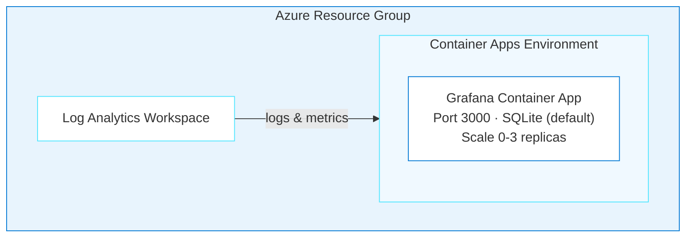

# Grafana on Azure Container Apps

> ✨ **No external database, no complex probes, just Grafana on Container Apps.**

<p align="center">
  
</p>

In this agentic journey, you'll deploy [Grafana OSS](https://grafana.com/oss/grafana/), a popular open-source observability platform, to Azure Container Apps. Grafana uses an embedded SQLite database by default, so there's no external database to provision. That makes it one of the simplest deployments in the project. You'll also look at when to swap SQLite for PostgreSQL.

## Learning Objectives

- Deploy Grafana to Azure Container Apps using agentic AI
- Understand why Grafana deploys with minimal configuration (no external database, fast startup)
- Evaluate SQLite vs PostgreSQL for different environments
- Use `/api/health` for reliable health probes
- Handle scale-to-zero cold starts gracefully

> ⏱️ **Estimated Time**: ~15 minutes
>
> 💰 **Estimated Cost**: ~$10-20/month (see [Cost Breakdown](#cost-breakdown)). Remember to clean up with `azd down` when done!
>
> 📋 **Prerequisites**: Azure CLI, Azure Developer CLI, and GitHub Copilot CLI. See [prerequisites](../../README.md#prerequisites) for installation links.

---

## Architecture



**Azure resources created:**

- **Azure Container Apps**: Serverless hosting with scale-to-zero
- **Azure Log Analytics**: Monitoring and diagnostics
- **SQLite** (default): Embedded database, no external dependency
- Optional: **Azure Database for PostgreSQL Flexible Server** for production persistence

> ⚠️ **Storage note:** Grafana uses SQLite by default, which lives inside the container. Dashboards and data sources are lost when the container restarts. See [Storage Considerations](#storage-sqlite-vs-postgresql) for production options.

**Infrastructure directory:** `infra-grafana/` (generated at the repo root when you run the deployment. It won't exist until then)

---

## Deploy with the Agent

You'll use `oss-to-azure-deployer` (a custom agent defined in this repo) in GitHub Copilot CLI to generate and deploy the entire infrastructure through conversation.

> **💡 Tip: Track issues as you go.** When giving Copilot CLI a prompt, add *"If you encounter any issues, log them to issues.md so they can be tracked and fixed."* This gives Copilot CLI a place to record problems it finds or fixes during generation, making it easier to iterate and debug.

### Step 1: Setup

Make sure you're in the repo root first:

```bash
cd github-azure-agentic-journeys
```

Then start GitHub Copilot CLI, a terminal-based AI assistant that can read, write, and run code in your project:

```bash
copilot
```

> **Don't have `copilot`?** Install it first. See [prerequisites](../../README.md#prerequisites) for the installation link.

Plugins extend what Copilot CLI can do. The Azure Skills plugin adds deployment tools, Bicep schema lookups, and infrastructure generation. Add the marketplace and install the plugin (first time only):

> **Note:** Lines starting with `>` in the code blocks below show what to type in the Copilot CLI session. Don't include the `>` character itself. It represents the Copilot CLI prompt.

```
> /plugin marketplace add microsoft/azure-skills
```

```
> /plugin install azure@azure-skills
```

> **Already installed?** The plugin persists across sessions. If you've done a previous journey, skip the install commands.
> For more details, see the [azure-skills repository](https://github.com/microsoft/azure-skills).

Now select the deployment agent. Agents are specialized personas that know how to handle specific tasks:

```
> /agent
```

Select **`oss-to-azure-deployer`** from the list. You're now in an interactive session with the deployment agent.

### Step 2: Deploy

<p align="center">
  
</p>

Tell the agent what you want in a single prompt:

```
> Deploy Grafana to Azure using Bicep and azd. Set the location to westus, generate a secure admin password, and resolve any issues that come up.
```

The agent handles the entire deployment:

1. Loads the right skills (`grafana-azure`, `azure-container-apps`, `azure-bicep-generation`, `azd-deployment`)

The agent loads the `grafana-azure` skill, which provides Grafana-specific configuration for health probes, ports, and environment variables.

2. Generates a lean Bicep (Azure's infrastructure-as-code language) structure in `infra-grafana/` with no PostgreSQL module needed (SQLite is the default)
3. Updates `azure.yaml`, registers Azure providers, sets environment variables
4. Runs `azd up`

> ⏳ **While you wait:** This is the fastest deployment in the project — no database to provision. While it runs, consider: *why* is it so fast? Compare the [architecture diagram](#architecture) to the [n8n architecture](../n8n/README.md#architecture). What's missing? (Answer: no database server. SQLite is embedded in the container, which means zero database provisioning time, but that comes with a tradeoff you'll discover in the [Assignment](#assignment).) You can also check what's being created by running `az resource list --resource-group rg-<env-name> --output table` in a separate terminal.

You can ask follow-up questions anytime:

```
> Should I use PostgreSQL instead of SQLite for Grafana?
```

The agent explains: SQLite is fine for dev/testing but dashboards are lost on container restart. For production, either mount Azure Files to `/var/lib/grafana` or switch to PostgreSQL.

### Step 3: Verify

Ask the agent to confirm everything is working:

```
> Verify the Grafana deployment is working. Check the health endpoint.
```

You can also verify manually. Open a new terminal and run the following commands to check the health endpoint:

```bash
# Store your deployed URL in a variable (azd env stores outputs from the deployment)
GRAFANA_URL=$(azd env get-value GRAFANA_URL)
curl -s "$GRAFANA_URL/api/health"
# Expected: {"commit":"...","database":"ok","version":"10.x.x"}
```

Open `$GRAFANA_URL` in your browser. Log in with the admin username and the password set during deployment. If you're not sure what password was generated, ask the agent: *"What's the Grafana admin password?"* It can retrieve it from the deployment environment.

If something goes wrong, just ask. You're still in the same session:

```
> Grafana is returning 502 errors
```

The agent will check if it's a cold start issue (scale-from-zero takes 30-60s) or a real problem.

---

<details>
<summary>Configuration Reference (handled by the agent automatically)</summary>

## Configuration Reference

### Environment Variables

| Variable | Value | Description |
|----------|-------|-------------|
| `GF_SECURITY_ADMIN_USER` | `admin` | Admin username |
| `GF_SECURITY_ADMIN_PASSWORD` | (secret) | Admin password |
| `GF_SERVER_HTTP_PORT` | `3000` | HTTP port |
| `GF_SERVER_ROOT_URL` | Auto-configured | Public URL |
| `GF_AUTH_ANONYMOUS_ENABLED` | `false` | Disable anonymous access |
| `GF_DATABASE_TYPE` | `sqlite3` | Default database |
| `GF_LOG_MODE` | `console` | Log output mode |
| `GF_LOG_LEVEL` | `info` | Log verbosity |

### Container Resources

| Setting | Value |
|---------|-------|
| Image | `docker.io/grafana/grafana:latest` |
| CPU | 0.5 cores |
| Memory | 1 GiB |
| Min Replicas | 0 (scale-to-zero) |
| Max Replicas | 3 |
| Scale Rule | HTTP requests (10 concurrent per replica) |

### Health Probes

Grafana starts fast (~15-30 seconds) and provides a dedicated health endpoint at `/api/health`.

| Probe | Initial Delay | Period | Failure Threshold |
|-------|---------------|--------|-------------------|
| Startup | n/a | 10s | 30 (5 min max) |
| Liveness | 15s | 30s | 3 |
| Readiness | n/a | 10s | 3 |

Health endpoint response:
```json
{"commit": "abc123", "database": "ok", "version": "10.x.x"}
```

### Storage: SQLite vs PostgreSQL

**SQLite (default):**
- Zero setup, embedded in the container
- ⚠️ Dashboards lost on container restart (ephemeral storage)
- Good for dev/testing

**PostgreSQL (production):**
Add these environment variables for persistent storage:

```yaml
GF_DATABASE_TYPE: postgres
GF_DATABASE_HOST: your-server.postgres.database.azure.com
GF_DATABASE_NAME: grafana
GF_DATABASE_USER: grafana
GF_DATABASE_PASSWORD: <secret>
GF_DATABASE_SSL_MODE: require
```

**Alternative:** Mount Azure Files to `/var/lib/grafana` for persistent SQLite.

---

## Cost Breakdown

| Resource | SKU | Monthly Cost |
|----------|-----|--------------|
| Container Apps (scale-to-zero) | Consumption (0.5 vCPU, 1GB) | ~$5-10 |
| Log Analytics | Pay-per-GB | ~$2-5 |
| **Total (SQLite)** | | **~$10-20/month** |
| + PostgreSQL (optional) | B_Standard_B1ms | +~$15/month |

</details>

---

<details>
<summary>Troubleshooting</summary>

## Troubleshooting

### Container Won't Start

Ask the agent to diagnose:

```
> My Grafana container won't start. Check the logs and tell me what's wrong.
```

The agent uses `azure_deploy_app_logs` to pull logs and identify the issue, typically health probes that are too aggressive. The Bicep templates in `infra-grafana/` include proper timing.

### 502 Bad Gateway

**Cause:** This typically happens on the first request after the container scales from zero. Cold start takes 30-60s. This is a one-time delay, not a persistent issue.

**Fix:** Wait 30-60 seconds and retry. For production, set `minReplicas: 1` to keep one instance warm.

### Login Fails

**Cause:** Password not set correctly, or special characters causing shell escaping issues.

**Fix:**

Ask the agent:

```
> My Grafana login isn't working. Check if the admin password environment variable is set correctly.
```

If the agent finds shell escaping issues, use alphanumeric passwords and redeploy.

### Dashboards Lost After Restart

**Cause:** SQLite stores data in ephemeral container storage.

**Fix:**
1. Add Azure Files volume mount for `/var/lib/grafana`
2. Switch to PostgreSQL backend (recommended for production)
3. Export dashboards as JSON and use Grafana provisioning

---

> **Post-Deployment Issues:** The following issues relate to *using* Grafana after deployment, not the deployment itself.

### Can't Connect to Data Sources

**Fix:**
1. Ensure data sources are in the same VNet or publicly accessible
2. For Azure services, use private endpoints
3. Check NSG rules if using VNet integration

### Out of Memory (OOMKilled)

**Fix:** Increase memory in Bicep:
```bicep
resources: {
  cpu: json('0.5')
  memory: '2Gi'  // Increase from 1Gi
}
```

</details>

---

## Cleanup

```bash
azd down --force --purge
```

Teardown takes 3-5 minutes (Container Apps environment deletion is slow).

---

## Key Learnings

- **No database doesn't mean no persistence problem.** SQLite is ephemeral in containers. Know this before deploying.
- **Scale-to-zero cold starts are normal.** 30-60s on first request isn't an error.
- **Same agent, different skills.** The agent loaded `grafana-azure` instead of `n8n-azure` and adapted automatically.
- **Simpler apps mean simpler infrastructure.** No database dependency means fewer moving parts to break.

---

## Assignment

1. Create a dashboard in Grafana, then restart the container app with `az containerapp revision restart`. Notice your dashboard is gone. Why? Ask the agent: *"Why did my Grafana dashboard disappear after a restart?"*
2. Try the fix: ask the agent *"How do I make Grafana dashboards persist across restarts?"* and implement what it suggests
3. Clean up with `azd down --force --purge`

---

## What's Next

In [Agentic Journey 03: Apache Superset](../superset/README.md), you'll deploy a full BI platform on Azure Kubernetes Service. You'll see why some apps need Kubernetes instead of Container Apps, and how the agent handles init containers, shared volumes, and psycopg2 installation.

> 📚 **See all agentic journeys:** [Back to overview](../../README.md#agentic-journeys)

---

## Resources

- [Grafana Documentation](https://grafana.com/docs/grafana/latest/)
- [Azure Container Apps](https://learn.microsoft.com/azure/container-apps/)
- [Azure Developer CLI](https://learn.microsoft.com/azure/developer/azure-developer-cli/)
