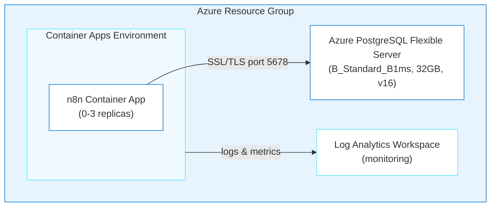

# n8n on Azure Container Apps

> ✨ **Deploy a self-hosted workflow automation platform to Azure by having a conversation with an AI agent.**

<p align="center">
  
</p>

Want workflow automation on Azure but don't want to write Bicep (Azure's infrastructure-as-code language)? Tell an AI agent what you want, and it generates the infrastructure, configures health probes, and deploys it. You'll have [n8n](https://n8n.io), an open-source workflow automation tool (like Zapier, but self-hosted), running on Container Apps with PostgreSQL in about 20 minutes.

## Learning Objectives

- Use `@oss-to-azure-deployer` in GitHub Copilot CLI to generate Azure infrastructure through conversation
- Understand how the agent loads app-specific and generic skills to build Bicep templates
- Deploy n8n to Azure Container Apps with PostgreSQL using `azd up`
- Configure health probes for slow-starting containers
- Troubleshoot common deployment issues using Azure MCP (Model Context Protocol) tools and container logs

> ⏱️ **Estimated Time**: ~20 minutes
>
> 💰 **Estimated Cost**: ~$25-35/month (see [Cost Breakdown](#cost-breakdown)). Remember to clean up with `azd down` when done!
>
> 📋 **Prerequisites**: Azure CLI, Azure Developer CLI, and GitHub Copilot CLI. See [prerequisites](../../README.md#prerequisites) for installation links.

---

## Architecture



**Azure resources created:**

- **Azure Container Apps**: Serverless hosting with scale-to-zero
- **Azure Database for PostgreSQL Flexible Server**: Managed database for persistent storage
- **Azure Log Analytics**: Centralized monitoring and logging
- **User-Assigned Managed Identity**: Secure access to Azure resources

**Infrastructure directory:** `infra-n8n/` (generated at the repo root when you run the deployment. It won't exist until then)

---

## Deploy with the Agent

You'll use `oss-to-azure-deployer` (a custom agent defined in this repo) in GitHub Copilot CLI to generate and deploy the entire infrastructure through conversation.

> **💡 Tip: Track issues as you go.** When giving Copilot CLI a prompt, add *"If you encounter any issues, log them to issues.md so they can be tracked and fixed."* This gives Copilot CLI a place to record problems it finds or fixes during generation, making it easier to iterate and debug.

### Step 1: Setup

Make sure you're in the repo root first:

```bash
cd github-azure-agentic-journeys
```

Then start GitHub Copilot CLI, a terminal-based AI assistant that can read, write, and run code in your project:

```bash
copilot
```

> **Don't have `copilot`?** Install it first. See [prerequisites](../../README.md#prerequisites) for the installation link.

Plugins extend what Copilot CLI can do. The Azure Skills plugin adds deployment tools, Bicep schema lookups, and infrastructure generation. Add the marketplace and install the plugin (first time only):

> **Note:** Lines starting with `>` in the code blocks below show what to type in the Copilot CLI session. Don't include the `>` character itself. It represents the Copilot CLI prompt.

```
> /plugin marketplace add microsoft/azure-skills
```

```
> /plugin install azure@azure-skills
```

> **Already installed?** The plugin persists across sessions. If you've done a previous journey, skip the install commands.
> For more details, see the [azure-skills repository](https://github.com/microsoft/azure-skills).

Now select the deployment agent. Agents are specialized personas that know how to handle specific tasks:

```
> /agent
```

Select **`oss-to-azure-deployer`** from the list. You're now in an interactive session with the deployment agent.

### Step 2: Deploy

<p align="center">
  
</p>

Tell the agent what you want in a single prompt:

```
> Deploy n8n to Azure using Bicep and azd. Set the location to westus, generate secure passwords for all credentials, and resolve any issues that come up.
```

The deployment takes several minutes. You'll see the agent generating Bicep files, registering Azure providers, and running `azd up`. It may prompt you to confirm your Azure subscription.

> ⏳ **While you wait:** The agent is provisioning your infrastructure. Here are some things to do while it runs:
>
> 1. Watch your resources appear in real-time. Open the [Azure Portal](https://portal.azure.com) → search for your resource group (`rg-<env-name>`), or run `az resource list --resource-group rg-<env-name> --output table` in a separate terminal.
> 2. Look at the [architecture diagram](#architecture) above. Match each box to a resource appearing in the portal.
> 3. Ask the agent: *"What's happening right now? Walk me through the deployment step by step."*
> 4. **Quiz yourself:** Why does n8n need a startup probe with a `failureThreshold` of 30? (Hint: check [Health Probes](#health-probes) below.)
> 5. Browse the [n8n workflow templates](https://n8n.io/workflows/) and pick one you want to try after deployment.

The agent handles the entire deployment:

1. Loads the right skills (`n8n-azure`, `azure-container-apps`, `azure-bicep-generation`, `azd-deployment`)
2. Uses Azure MCP tools to look up Bicep schemas and best practices
3. Generates modular Bicep infrastructure in `infra-n8n/`
4. Updates `azure.yaml`, registers Azure providers, sets environment variables
5. Runs `azd up`
6. Configures `WEBHOOK_URL` via post-provision hook

You can ask follow-up questions anytime during or after generation:

```
> Why did you set the liveness probe to 60 seconds?
> What does the post-provision hook do?
```

### Step 3: Verify

Ask the agent to confirm everything is working:

```
> Verify the n8n deployment is working. Check the health endpoint and container logs.
```

The agent uses `azure_deploy_app_logs` (an Azure MCP tool that fetches container logs) to confirm the deployment is healthy.

You can also verify manually. Open a new terminal and run the following commands to check the health endpoint:

```bash
# Store your deployed URL in a variable (azd env stores outputs from the deployment)
N8N_URL=$(azd env get-value N8N_URL)

# Check the HTTP status code (200 means the app is responding)
curl -s -o /dev/null -w "%{http_code}" "$N8N_URL"
# Expected: 200

# Verify the page title confirms it's n8n
curl -s "$N8N_URL" | grep -o "<title>[^<]*</title>"
# Expected: <title>n8n.io - Workflow Automation</title>
```

If something goes wrong, just ask. You're still in the same session with full context:

```
> The container is in CrashLoopBackOff, what's happening?
```

For a more detailed checklist, see the troubleshooting section.

---

<details>
<summary>Configuration Reference (handled by the agent automatically)</summary>

## Configuration Reference

### Environment Variables

The deployment automatically configures these n8n environment variables:

| Variable | Value | Description |
|----------|-------|-------------|
| `DB_TYPE` | `postgresdb` | Database type |
| `DB_POSTGRESDB_HOST` | Azure PostgreSQL FQDN | Database server address |
| `DB_POSTGRESDB_PORT` | `5432` | PostgreSQL port |
| `DB_POSTGRESDB_DATABASE` | `n8n` | Database name |
| `DB_POSTGRESDB_SSL_ENABLED` | `true` | Required for Azure PostgreSQL |
| `DB_POSTGRESDB_SSL_REJECT_UNAUTHORIZED` | `false` | Azure cert compatibility |
| `DB_POSTGRESDB_CONNECTION_TIMEOUT` | `60000` | 60s timeout for cold starts |
| `N8N_ENCRYPTION_KEY` | Auto-generated | Encryption key for credentials |
| `N8N_BASIC_AUTH_ACTIVE` | `true` | Enable basic authentication |
| `N8N_PORT` | `5678` | n8n default port |
| `N8N_PROTOCOL` | `https` | Protocol for generated URLs |
| `WEBHOOK_URL` | Auto-configured | Set by post-provision hook |

### Container Resources

| Setting | Value |
|---------|-------|
| Image | `docker.io/n8nio/n8n:latest` |
| CPU | 1.0 core |
| Memory | 2 GiB |
| Min Replicas | 0 (scale-to-zero) |
| Max Replicas | 3 |
| Scale Rule | HTTP requests (10 concurrent per replica) |

### Health Probes

n8n requires **60+ seconds** to start. Without proper health probes, Azure kills the container before initialization completes.

| Probe | Initial Delay | Period | Failure Threshold | Max Wait |
|-------|---------------|--------|-------------------|----------|
| Startup | n/a | 10s | 30 | 5 minutes |
| Liveness | 60s | 30s | 3 | n/a |
| Readiness | n/a | 10s | 3 | n/a |

### Secrets Management

Sensitive values are stored as Container App secrets and referenced via `secretRef`:

- `postgres-password` → `DB_POSTGRESDB_PASSWORD`
- `n8n-encryption-key` → `N8N_ENCRYPTION_KEY`
- `n8n-auth-password` → `N8N_BASIC_AUTH_PASSWORD`

---

## Cost Breakdown

| Resource | SKU | Monthly Cost |
|----------|-----|--------------|
| Container Apps (scale-to-zero) | Consumption (1 vCPU, 2GB) | ~$5-15 |
| PostgreSQL Flexible Server | B_Standard_B1ms (32GB) | ~$15 |
| Log Analytics | Pay-per-GB (30-day retention) | ~$2-5 |
| **Total** | | **~$25-35/month** |

Scale-to-zero keeps costs low during idle periods. For production with `minReplicas: 1`, expect ~$60-80/month for Container Apps alone.

</details>

---

<details>
<summary>Troubleshooting</summary>

## Troubleshooting

### Container CrashLoopBackOff

**Symptom:** Container restarts repeatedly, logs show health check failures.

**Cause:** n8n needs 60+ seconds to start, and default health probes kill it too early.

**Fix:** Ensure health probes are configured with `initialDelaySeconds: 60` on liveness and `failureThreshold: 30` on startup. The Bicep templates in `infra-n8n/` already include this.

Ask the agent to diagnose:

```
> My n8n container keeps restarting. Check the logs and tell me what's wrong.
```

The agent uses `azure_deploy_app_logs` to pull logs and identify the issue.

### Database Connection Refused

**Symptom:** n8n logs show `ECONNREFUSED` or SSL handshake errors.

**Fix:**
1. Always use PostgreSQL **FQDN** (not internal hostname)
2. Enable SSL: `DB_POSTGRESDB_SSL_ENABLED=true`
3. Set `DB_POSTGRESDB_SSL_REJECT_UNAUTHORIZED=false` (Azure cert compatibility)
4. Increase connection timeout to 60s for cold starts

### WEBHOOK_URL Not Set

**Symptom:** Webhooks don't work, static assets fail to load.

**Cause:** Circular dependency: the FQDN isn't known until Container App is created.

**Fix:** The post-provision hook handles this automatically. If it wasn't set, ask the agent:

```
> The WEBHOOK_URL isn't set on my n8n container. Fix it using the container's FQDN.
```

### Resource Provider 409 Conflicts

**Fix:** Register providers before deployment:

```bash
az provider register --namespace Microsoft.App
az provider register --namespace Microsoft.DBforPostgreSQL
az provider register --namespace Microsoft.OperationalInsights
```

### newGuid() Bicep Error

`newGuid()` can only be used as a **parameter default value**:

```bicep
// ❌ Wrong
var encryptionKey = newGuid()

// ✅ Correct
@secure()
param n8nEncryptionKey string = newGuid()
```

</details>

---

## Cleanup

```bash
azd down --force --purge
```

Teardown takes 3-5 minutes (PostgreSQL deletion is slow). This permanently deletes all data. Export workflows first.

---

## Key Learnings

- **Post-provision hooks** solve circular dependencies (like WEBHOOK_URL needing the deployed URL)
- **Azure MCP tools** give the agent real-time access to Bicep schemas. It's looking up actual API versions, not guessing.
- **Register providers first.** This prevents 409 conflicts during deployment.
- **Same agent, different skills.** The agent loaded `n8n-azure` and adapted to n8n's specific requirements automatically.

---

## Assignment

1. Ask the agent: *"How would I add a custom domain to my n8n deployment?"*
2. Create a simple workflow in n8n: add an HTTP Request node that calls `https://api.github.com/zen`, connect it to a Set node, and run it. This confirms your deployed n8n instance can make outbound API calls.
3. Clean up with `azd down --force --purge`

---

## What's Next

In [Agentic Journey 02: Grafana](../grafana/README.md), you'll deploy a metrics and visualization platform, the simplest deployment in the project (~2 minutes, no external database). You'll see how the same agent adapts when the app has different requirements.

> 📚 **See all agentic journeys:** [Back to overview](../../README.md#agentic-journeys)

---

## Resources

- [n8n Documentation](https://docs.n8n.io/)
- [Azure Container Apps](https://learn.microsoft.com/azure/container-apps/)
- [Azure Database for PostgreSQL](https://learn.microsoft.com/azure/postgresql/)
- [Azure Developer CLI](https://learn.microsoft.com/azure/developer/azure-developer-cli/)
