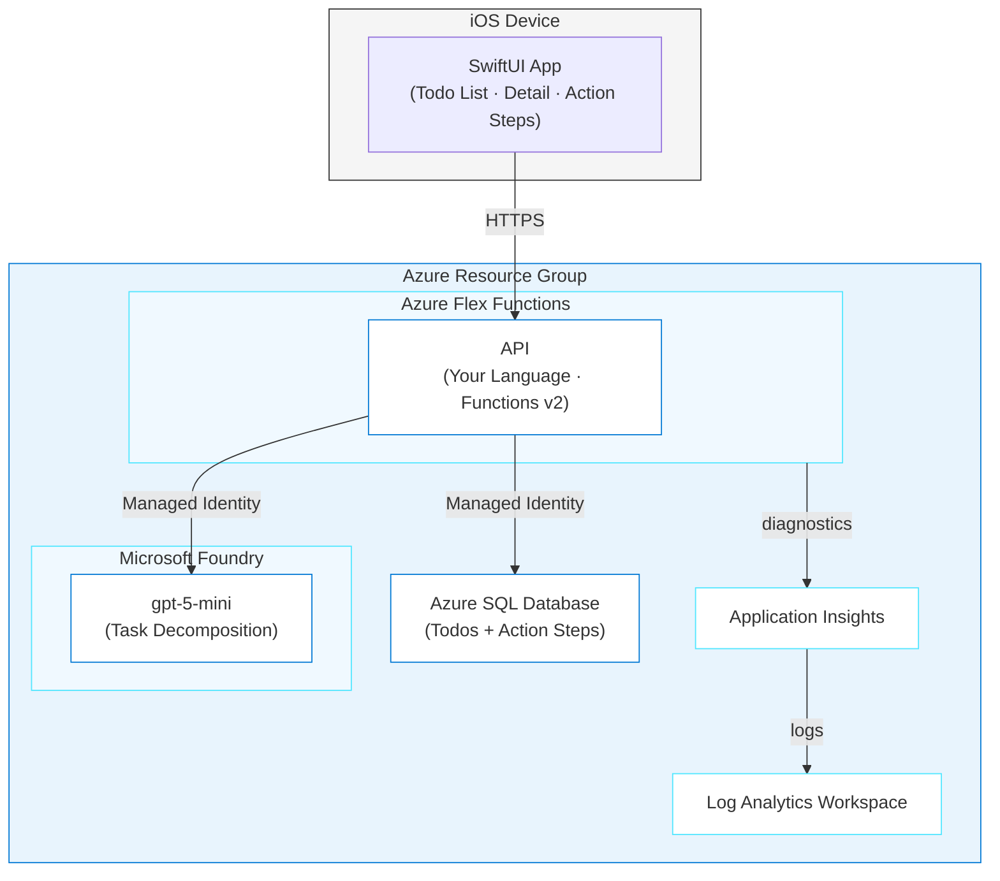

# SmartTodo - AI-Powered Task App

> ✨ **Type a fuzzy goal, get a step-by-step action plan, powered by Azure Functions, Azure SQL, and Microsoft Foundry.**

<p align="center">
  
</p>

You'll build SmartTodo: an iPhone app where you type a todo like "Prepare Conference talk" and AI breaks it into concrete steps you can check off. The backend runs on Azure Functions Flex Consumption, Azure SQL stores the data, and gpt-5-mini on Microsoft Foundry handles the thinking. Pick your language (Node.js, Python, .NET, or Java), hand Copilot CLI a spec, and it scaffolds the API, generates SwiftUI screens, and deploys the backend to Azure.

## Learning Objectives

- Use a spec document as shared context for Copilot CLI to scaffold a serverless API and iOS app together
- Build an Azure Functions API in your language of choice with the repository pattern
- Connect Azure Functions to Azure SQL using managed identity, with no passwords in code
- Call gpt-5-mini via Microsoft Foundry to decompose vague goals into actionable steps
- Structure a SwiftUI app that talks to a cloud API with async/await networking
- Deploy the backend to Azure Functions Flex Consumption with `azd` and point the iOS app at the live URL

> ⏱️ **Estimated Time**: ~2.5 hours (includes building, testing, and deploying all 3 phases)
>
> 💰 **Estimated Cost**: ~$10-30/month (Functions Flex Consumption + SQL Basic + AI pay-per-token; see [Cost Breakdown](#cost-breakdown)). **Clean up with `azd down` when done!**
>
> 📋 **Prerequisites**: See [prerequisites](../../README.md#prerequisites) for standard installation links.
>
> **Additional prerequisites for this journey:**
> - Your language runtime: [Node.js LTS](https://nodejs.org/), [Python 3.10+](https://python.org/), [.NET 8+](https://dotnet.microsoft.com/), or [Java 17+](https://learn.microsoft.com/java/openjdk/download)
> - [Azure Functions Core Tools v4](https://learn.microsoft.com/azure/azure-functions/functions-run-local): local Functions development
> - [Xcode](https://developer.apple.com/xcode/): iOS simulator installed (macOS only)

> ⚠️ **macOS required for Phase 2:** The SwiftUI iOS app requires Xcode, which only runs on macOS. If you're on Windows or Linux, you can complete Phase 1 (API) and Phase 3 (Deploy) and test the API with curl instead of the iOS app.

---

## Architecture



**Azure resources created:**

- **Azure Flex Functions**: Serverless hosting for the API (Flex Consumption plan)
- **Azure SQL Database**: Stores todos and AI-generated action steps
- **Microsoft Foundry** (AIServices): gpt-5-mini for task decomposition
- **Application Insights + Log Analytics**: Monitoring and diagnostics
- **Storage Account**: Required by Functions runtime

---

## The Spec

SmartTodo is driven by a spec document: [`PLAN.md`](./PLAN.md) in this journey folder. It defines the data models, API contracts, AI prompt design, and seed data. You don't need to read the whole thing. Copilot CLI reads it for you and generates code that matches.

**Core data model (the parts you'll build):**

| Entity | Key Fields | Purpose |
|--------|-----------|---------|
| **Todo** | id, title, status, userId, stepsGenerated | Top-level task entered by the user |
| **ActionStep** | id, todoId, title, description, order, isCompleted | AI-generated sub-task with actionable detail |

**API endpoints you'll generate:**

| Method | Path | Description |
|--------|------|-------------|
| `GET` | `/api/todos` | List todos for a user |
| `POST` | `/api/todos` | Create a new todo |
| `PATCH` | `/api/todos/:id` | Update a todo's title or status |
| `DELETE` | `/api/todos/:id` | Delete a todo and its steps |
| `POST` | `/api/todos/:id/generate-steps` | AI-generate action steps from the todo title |
| `PATCH` | `/api/todos/:id/steps/:stepId` | Toggle a step's completion |

---

## The Journey

SmartTodo is built in three phases. Phase 1 builds the API with Azure SQL, Phase 2 adds the SwiftUI app, and Phase 3 deploys the backend to Azure. The [`PLAN.md`](./PLAN.md) spec is your shared context throughout.

**How this journey works:** You won't paste one giant prompt and get a finished app. Instead, you'll build incrementally. Ask Copilot CLI for a piece, inspect what it generated, test it, fix issues, and then move on. This is how developers actually work with AI: generate → inspect → test → refine.

> **💡 Tip: Track issues as you go.** When giving Copilot CLI a prompt, add *"If you encounter any issues, log them to issues.md so they can be tracked and fixed."* This gives Copilot CLI a place to record problems it finds or fixes during generation, making it easier to iterate and debug.

> **Note on the iOS app:** The SwiftUI app runs on your Mac (Simulator) or iPhone. It is NOT deployed by `azd`. Only the Azure backend is. The app points at the deployed API URL via a `Config.swift` file.

### Phase 1: Build the API (~45 min)

<p align="center">
  
</p>

> **📋 Local database setup:** This API uses Azure SQL. For local development, you have two options:
> 1. **Use a local SQL Server** (recommended): Run `docker run -e "ACCEPT_EULA=Y" -e "SA_PASSWORD=YourStrong!Pass123" -p 1433:1433 -d mcr.microsoft.com/mssql/server:2022-latest` and set `AZURE_SQL_SERVER=localhost`, `AZURE_SQL_USER=sa`, `AZURE_SQL_PASSWORD=YourStrong!Pass123` in `local.settings.json`.
> 2. **Use Azure SQL directly**: Create a free-tier Azure SQL database in the portal and use its connection details in `local.settings.json`.
>
> Phase 3 creates the production Azure SQL instance automatically, so if you don't want to worry about it locally, you can skip local setup.

You'll build the API in stages, not all at once. Each step teaches a different aspect of working with Copilot CLI.

#### Step 1: Set up the project

Create a new directory and copy the spec into it:

```bash
mkdir ~/smart-todo && cd ~/smart-todo
cp /path/to/github-azure-agentic-journeys/journeys/smart-todo/PLAN.md .
```

Start Copilot CLI:

```bash
copilot
```

Once inside the interactive session, add the marketplace (first time only):

> **Note:** Lines starting with `>` in the code blocks below show what to type in the Copilot CLI session. Don't include the `>` character itself.

```
> /plugin marketplace add microsoft/azure-skills
```

Then install the plugin:

```
> /plugin install azure@azure-skills
```

> **Already installed?** The plugin persists across sessions. If you've done a previous journey, skip the install commands.
> For more details, see the [azure-skills repository](https://github.com/microsoft/azure-skills).

Your `local.settings.json` should look like this (fill in your values):

```json
{
  "IsEncrypted": false,
  "Values": {
    "AzureWebJobsStorage": "UseDevelopmentStorage=true",
    "FUNCTIONS_WORKER_RUNTIME": "node",
    "AZURE_SQL_SERVER": "localhost",
    "AZURE_SQL_DATABASE": "SmartTodo",
    "AZURE_SQL_USER": "sa",
    "AZURE_SQL_PASSWORD": "YourStrong!Pass123",
    "AZURE_AI_ENDPOINT": "",
    "AZURE_AI_DEPLOYMENT": "gpt-5-mini",
    "AZURE_AI_KEY": ""
  }
}
```

Leave the AI values empty for now. You'll fill them in during Step 4 when you add AI-powered step generation.

#### Step 2: Generate the data models and data layer

Start with the data models and repository pattern, not the full API. This lets you inspect what Copilot CLI produces before building on top of it.

```
> Read the PLAN.md file in this directory. Create an Azure Functions v2 
  project in my chosen language in a src/api/ subdirectory. Initialize 
  with host.json, local.settings.json, and language-appropriate config.
  Then create:
  1. Data models for Todo and ActionStep from the Phase 1 spec
  2. Repository interfaces (TodoRepository, ActionStepRepository) 
  3. Azure SQL implementation using the appropriate SQL driver for my language
  4. A factory that returns the Azure SQL DataStore
  5. Seed data from the PLAN.md tables with exact IDs
```

**🔍 Inspect what was generated:**

Open the repository interfaces file. Look for:
- Does `TodoRepository` have `getAll(userId)`, `getById(id)`, `create()`, `update()`, `delete()`?
- Does `ActionStepRepository` have `getByTodoId()`, `create()`, `update()`, `deleteByTodoId()`?

Open the Azure SQL implementation. Look for:
- Are parameterized queries used (not string concatenation)?
- Does `delete` cascade to action steps?
- Is the `order` column quoted with brackets (`[order]`)? It's a reserved word in SQL.
- Does it use managed identity auth for Azure SQL?

If anything's off, tell Copilot CLI:

```
> The Azure SQL implementation isn't quoting the "order" column name. 
  It's a reserved word in SQL — wrap it in brackets: [order].
```

**💡 What you're learning:** The repository pattern separates "what data operations exist" from "how they talk to a database." Functions never import the database client directly. Instead, they get a `DataStore` from the factory. This keeps function handlers clean and testable.

#### Step 3: Generate the API endpoints

Now add the Azure Functions HTTP triggers that use the repository interfaces.

```
> Read the API Endpoints section in PLAN.md. Create HTTP-triggered functions 
  in src/api/src/functions/ for each endpoint: getTodos, createTodo, 
  updateTodo, deleteTodo, generateSteps, and updateStep. Each function 
  should get a DataStore from the factory — never import the database 
  directly. Follow the request/response formats from the spec. For now, 
  stub generateSteps to return a 501 — we'll add AI in the next step.
```

**🔍 Inspect what was generated:**

Check the todo creation function. Look for:
1. Does `POST /api/todos` validate that `title` is non-empty and under 500 characters?
2. Does it require `userId`?
3. Does it return 201 with the created todo (not 200)?
4. Does the error response match the spec format `{ error: { code, message } }`?

Check the step update function:
1. Does `PATCH /api/todos/:id/steps/:stepId` auto-complete the todo when all steps are done?
2. Does it set the todo back to `in_progress` when a completed step is unchecked?

```
> The updateStep function doesn't auto-complete the parent todo when all 
  steps are marked done. Read the "Auto-completion rule" in PLAN.md and 
  implement it.
```

**💡 What you're learning:** Auto-completion is a cross-entity business rule. Changing a step affects the parent todo's status. AI generation usually gets single-entity CRUD right but misses these cross-cutting concerns. This is exactly the kind of thing to look for when reviewing generated code.

#### Step 4: Add AI-powered step generation

Now wire up the real AI call to replace the stub.

```
> Read the Phase 3 AI Features section in PLAN.md. Implement the 
  generateSteps function to call gpt-5-mini via the openai SDK for
  my language. Use the exact system prompt from the spec. The client 
  connects to Microsoft Foundry using the AZURE_AI_ENDPOINT (with 
  /openai/v1/ path) and AZURE_AI_KEY env vars. Parse the AI response 
  as a JSON array, validate each item has title and description, assign
  sequential order values, and insert into the database. If steps 
  already exist (stepsGenerated is true), delete them first and 
  regenerate.
```

**🔍 Inspect what was generated:**

1. Is the system prompt clear about returning ONLY a JSON array with no markdown wrapping?
2. Does it strip markdown code fences (` ```json `) from the response before parsing?
3. Does it retry once if the response isn't valid JSON?
4. Does it handle AI service errors gracefully (timeout, rate limit → 503)?
5. Does it set `stepsGenerated = true` on the todo after inserting steps?

**💡 What you're learning:** Getting an LLM to return consistent, parseable output is the hardest part of AI integration. The system prompt has to be explicit about format ("ONLY a JSON array, no markdown"), and the code needs defensive parsing. This applies to every LLM-backed feature, not just SmartTodo.

#### Step 5: Test the API yourself

Don't ask Copilot CLI to test. Run these yourself and understand what each one verifies.

Start the Functions dev server, then in a new terminal:

```bash
cd src/api
# Install dependencies and seed (language-specific commands)
# Node.js: npm install && npm run seed && npm run build && npm start
# Python:  pip install -r requirements.txt && python seed.py && func start
# .NET:    dotnet build && func start
# Java:    mvn package && func start
```

> **⚠️ Node.js note:** If Functions fails to find any functions, check that `"main"` in `package.json` is `"dist/functions/*.js"` (not `"dist/src/functions/*.js"`). Since `tsconfig.json` sets `rootDir: "src"`, the `src/` prefix is stripped from the output path.

```bash
# Does the server start and respond?
curl http://localhost:7071/api/todos?userId=user-1
# Expected: JSON array of seed todos, e.g. [{"id":"todo-1","title":"...","status":"not_started",...}, ...]

# Create a new todo
curl -X POST http://localhost:7071/api/todos \
  -H "Content-Type: application/json" \
  -d '{"title": "Prepare Conference talk", "userId": "user-1"}'
# Expected: 201 response with the created todo JSON, e.g. {"id":"<new-uuid>","title":"Prepare Conference talk",...}

# Update a todo's status
curl -X PATCH http://localhost:7071/api/todos/todo-1 \
  -H "Content-Type: application/json" \
  -d '{"status": "in_progress"}'
# Expected: 200 response with updated todo, status should be "in_progress"

# Generate AI steps (requires AZURE_AI_ENDPOINT and AZURE_AI_KEY in local.settings.json)
curl -X POST http://localhost:7071/api/todos/todo-1/generate-steps
# Expected: 200 response with {"steps": [...]} containing 3-7 action steps

# Toggle a step's completion
curl -X PATCH http://localhost:7071/api/todos/todo-2/steps/step-2-3 \
  -H "Content-Type: application/json" \
  -d '{"isCompleted": true}'
# Expected: 200 response with the step JSON, isCompleted should be true

# Delete a todo (should cascade-delete steps)
curl -X DELETE http://localhost:7071/api/todos/todo-3
# Expected: 204 No Content (empty response body)
curl http://localhost:7071/api/todos?userId=user-1  # todo-3 should be gone
# Expected: JSON array without todo-3
```

If any test fails, describe the failure to Copilot CLI and let it fix it:

```
> The DELETE endpoint returns 200 instead of 204. Fix it to return 
  204 with no response body.
```

**💡 What you're learning:** Running tests yourself (instead of delegating) builds understanding. After this, you know what the API returns, how cascade deletes work, and where to look when something breaks after deployment.

---

### Phase 2: Build the iOS App (~45 min)

<p align="center">
  
</p>

> **New to Swift?** SwiftUI uses `Codable` for JSON serialization (similar to TypeScript interfaces), `async/await` for network calls (same concept as JavaScript/Python), and `#if DEBUG` for compile-time feature flags. The `.xcodeproj` file is Xcode's project format. Copilot CLI generates the Swift source files, but you'll open the project in Xcode to build and run it.

#### Step 1: Generate the SwiftUI project

```
> Read the Phase 2 section in PLAN.md. Create a SwiftUI iOS app in 
  src/ios/SmartTodo/. Include:
  - Models matching the API types (Todo, ActionStep) using Codable
  - An APIClient using URLSession with async/await
  - A Config.swift with #if DEBUG for localhost vs production URL
  - Views: TodoListView (main list), AddTodoView (sheet), 
    TodoDetailView (with Generate Steps button), ActionStepsView 
    (ordered checkable list with progress bar)
  Use the exact model fields and view descriptions from the spec.
```

**🔍 Inspect what was generated:**

Open `APIClient.swift`. Look for:
- Does it use `async throws` functions with `URLSession.shared.data(for:)`?
- Does it decode the API error format `{ error: { code, message } }` into descriptive errors?
- Is the base URL pulled from `Config.swift` (not hardcoded)?

Open `TodoDetailView.swift`. Look for:
- Is there a "Generate Steps" button when `stepsGenerated == false`?
- Is there a "Regenerate Steps" button when `stepsGenerated == true`?
- Does it show a `ProgressView` during AI generation?

Open `ActionStepsView.swift`. Look for:
- Are steps numbered and ordered by the `order` field?
- Do completed steps show strikethrough?
- Is there a progress bar showing completion percentage?

```
> The TodoDetailView doesn't show a loading state during step generation. 
  Add a ProgressView that shows while the generateSteps API call is in 
  flight. Disable the Generate button during loading.
```

**💡 What you're learning:** The iOS app is a thin client. All business logic lives in the API. The app just displays data and sends user actions. You can update the AI prompt, change the database, or add features without touching the Swift code, as long as the API contract stays the same.

#### Step 2: Test on the Simulator

Run the API locally, then build and run the iOS app in Xcode:

1. Open `src/ios/SmartTodo/SmartTodo.xcodeproj` in Xcode
2. Select an iPhone 16 simulator
3. Build and Run (⌘R)
4. Verify: seed todos load, you can add a todo, tapping a todo shows its detail view

**🧪 Test it yourself:**

1. Add a new todo: "Plan a weekend camping trip"
2. Tap the todo → tap "Generate Steps"
3. Watch the loading indicator → verify 3-7 actionable steps appear
4. Check off two steps → verify the progress bar updates
5. Check off ALL steps → verify the todo status changes to "completed"
6. Go back to the list → verify the status badge shows "completed"

If the app can't reach the API, check that:
- The API is running on `localhost:7071`
- `Config.swift` has `http://localhost:7071` for the `DEBUG` build
- App Transport Security allows local HTTP (should be automatic in the Simulator)

---

### Phase 3: Deploy to Azure (~45 min)

<p align="center">
  
</p>

#### Option A: Deploy with Copilot CLI

##### Step 1: Generate infrastructure

```
> Read the Phase 4 (Deploy) section in PLAN.md. Create Bicep infrastructure 
  in an infra/ directory. Use Azure Verified Modules (AVM) for all resources:
  - Azure Flex Functions with br/public:avm/res/web/site (kind: functionapp,linux)
  - App Service Plan with br/public:avm/res/web/serverfarm (Flex Consumption SKU: FC1)
  - Azure SQL Server with br/public:avm/res/sql/server
  - Azure SQL Database as a child resource
  - Microsoft Foundry with br/public:avm/ptn/ai-ml/ai-foundry (gpt-5-mini deployment)
  - Monitoring with br/public:avm/ptn/azd/monitoring
  - Storage Account with br/public:avm/res/storage/storage-account
  - System-assigned managed identity on the Function App
  - Role assignment: Cognitive Services User on Microsoft Foundry
  - Azure SQL firewall: allow Azure services
  - Outputs in SCREAMING_SNAKE_CASE: API_URL, SQL_SERVER_NAME, etc.
  - azd-service-name: 'api' tag on the Function App
  Also create an azure.yaml with a single 'api' service using host: function
  and language set to match my chosen stack.
```

**🔍 Before deploying, review these critical details:**

1. Open `infra/main.bicep`. Does the Function App have `tags: { 'azd-service-name': 'api' }`? Without this, `azd deploy` can't find the app.
2. Are ALL resources from AVM modules (not raw resource definitions)?
3. Is there a role assignment giving the Function App's managed identity `Cognitive Services User` on the Microsoft Foundry resource?
4. Does the SQL server have a firewall rule allowing Azure services (`0.0.0.0` start/end IP)?
5. Are outputs in SCREAMING_SNAKE_CASE? (`API_URL`, not `apiUrl`)

**💡 What you're learning:** Managed identity means the Function App authenticates to Azure SQL and Microsoft Foundry without API keys or connection strings. The Bicep template creates the identity and role assignments declaratively, with no portal clicks required. This is how production Azure apps handle service-to-service auth.

##### Step 2: Deploy

Pre-deployment (once per subscription):

```bash
az provider register --namespace Microsoft.Web
az provider register --namespace Microsoft.Sql
az provider register --namespace Microsoft.CognitiveServices
az provider register --namespace Microsoft.OperationalInsights
```

Set subscription and deploy:

```bash
azd env set AZURE_SUBSCRIPTION_ID $(az account show --query id -o tsv)
azd up
```

> ⏳ **While you wait:** Azure is provisioning your Function App, SQL Database, and Microsoft Foundry. Here's how to use the time:
>
> 1. Watch your resources appear in real-time. Open the [Azure Portal](https://portal.azure.com) → search for your resource group, or run `az resource list --resource-group rg-<env-name> --output table` in a separate terminal.
> 2. Re-read your `infra/main.bicep`. Can you trace how the Function App gets access to Microsoft Foundry? (Hint: look for the managed identity and role assignment.)
> 3. Preview what's next: open `PLAN.md` and read the Phase 3 section (iOS app). What SwiftUI components will you need?
> 4. Ask the agent: *"/btw Explain how managed identity works in this deployment. Why don't we need API keys?"*

Deployment may take several minutes. If it fails, ask Copilot CLI to help diagnose:

```
> azd up failed with this error: [paste the error]. What's wrong?
```

##### Step 3: Set up Azure SQL managed identity access

The Bicep template creates the identity, but Azure SQL requires a SQL command to grant access. Install `sqlcmd` if needed (`brew install sqlcmd` on macOS), then run:

This command creates a database user for the Function App's managed identity and grants it read/write permissions. Bicep can create Azure-level role assignments, but SQL Server has its own user system that requires a separate SQL command. You need to be an Azure AD admin on the SQL server for this to work. The Bicep template sets the deploying user as the Azure AD admin, so this should work if you ran `azd up` from the same account.

> ⚠️ **You must be the Azure AD admin on the SQL server.** If this command fails with a permissions error, check that your Azure account is set as the server's Azure AD admin in the Azure Portal under SQL Server > Microsoft Entra admin.

```bash
SQL_SERVER=$(azd env get-value SQL_SERVER_NAME)
SQL_DB=$(azd env get-value SQL_DATABASE_NAME)
FUNC_APP=$(azd env get-value FUNCTION_APP_NAME)

# Get an access token for Azure SQL (you must be Azure AD admin on the SQL server)
ACCESS_TOKEN=$(az account get-access-token --resource https://database.windows.net/ --query accessToken -o tsv)

# Create the managed identity user and grant roles
sqlcmd -S "${SQL_SERVER}.database.windows.net" -d "$SQL_DB" \
  --authentication-method=ActiveDirectoryAccessToken --access-token "$ACCESS_TOKEN" \
  -Q "IF NOT EXISTS (SELECT * FROM sys.database_principals WHERE name = '${FUNC_APP}') BEGIN CREATE USER [${FUNC_APP}] FROM EXTERNAL PROVIDER; ALTER ROLE db_datareader ADD MEMBER [${FUNC_APP}]; ALTER ROLE db_datawriter ADD MEMBER [${FUNC_APP}]; END"
```

##### Step 4: Verify the live deployment

```bash
API_URL=$(azd env get-value API_URL)

# API responds?
curl -s "$API_URL/api/todos?userId=user-1"

# Create a todo
curl -s -X POST "$API_URL/api/todos" \
  -H "Content-Type: application/json" \
  -d '{"title": "Prepare Conference talk", "userId": "user-1"}'

# Generate AI steps
TODO_ID=$(curl -s "$API_URL/api/todos?userId=user-1" | python3 -c "import sys,json; print(json.load(sys.stdin)[0]['id'])")
curl -s -X POST "$API_URL/api/todos/$TODO_ID/generate-steps" | python3 -m json.tool
```

##### Step 5: Point the iOS app at Azure

The simplest way: replace `Config.swift` with the deployed URL directly (removing the `#if DEBUG` conditional):

```swift
enum Config {
    static let apiBaseURL = "https://<your-function-app>.azurewebsites.net"
    static let defaultUserId = "user-1"
}
```

Get the actual URL:

```bash
azd env get-value API_URL
```

Build and Run in Xcode (⌘R) on the Simulator. Verify the full flow: add a todo → generate steps → check them off. You can restore the `#if DEBUG` conditional later if you want to switch between local and production.

#### Option B: Deploy with GitHub Copilot cloud agent

Create a GitHub issue and assign it to GitHub Copilot:

```
> Create a GitHub issue titled "Deploy SmartTodo backend to Azure" with these 
  requirements:
  - Create Bicep infrastructure using AVM modules for Azure Flex Functions, 
    Azure SQL, Microsoft Foundry (gpt-5-mini), and monitoring
  - Create azure.yaml with a single 'api' service (host: function)
  - Use managed identity for SQL and AI auth (no connection strings)
  - Follow the Phase 4 spec in PLAN.md
  Assign the issue to Copilot.
```

Review the PR, test the deployment, then merge.

---

#### 🧪 Try it yourself: Improve the AI

Now that you have the full workflow down, try improving the AI output:

```
> The AI-generated steps are too generic. Update the system prompt to 
  ask for time estimates on each step and to make descriptions more 
  specific. For example, instead of "Research the topic" say 
  "Spend 2 hours reading the top 5 blog posts about [topic]."
```

Test it, deploy with `azd up`, and compare the new steps with the old ones.

---

## How Agentic AI is Used

<p align="center">
  
</p>

Here's where agentic AI shows up in this journey:

| Layer | Use Case | What It Demonstrates |
|-------|----------|---------------------|
| **Code generation** | Copilot CLI scaffolds Functions, data layer, and SwiftUI app from a spec | Break work into pieces, inspect each one, iterate on gaps |
| **Code review** | You review generated code for business logic correctness | AI gets CRUD right but misses cross-entity rules like auto-completion |
| **Task decomposition** | gpt-5-mini breaks vague goals into actionable steps | LLMs excel at structured output when prompts are explicit about format |
| **Infrastructure** | Copilot CLI generates Bicep with AVM modules and managed identity | Review deployment config carefully. Missing role assignments break silently |
| **Debugging** | Ask Copilot CLI to diagnose deployment or runtime errors | Describe errors, let AI suggest fixes, verify yourself |
| **Delegation** | GitHub Copilot cloud agent creates the deployment PR from an issue | Write well-scoped issues with acceptance criteria, review the PR |

---

## Cost Breakdown

| Resource | SKU | Monthly Cost |
|----------|-----|--------------|
| Azure Functions | Flex Consumption (scale to zero) | ~$0-5 |
| Azure SQL Database | Basic (5 DTU) | ~$5 |
| Microsoft Foundry (AIServices) | Pay-per-token (gpt-5-mini) | ~$1-10 |
| Application Insights | Pay-per-GB | ~$0-5 |
| Log Analytics | Pay-per-GB | ~$0-5 |
| Storage Account | Standard LRS | ~$1 |
| **Total** | | **~$10-30/month** |

Functions and Microsoft Foundry scale to zero when idle, so you pay almost nothing during development. Azure SQL Basic is the floor at ~$5/month. Clean up with `azd down` when done.

---

## Troubleshooting

### Function App returns 500 on database calls

**Cause:** Managed identity not granted access to Azure SQL. The identity needs to be added as a database user with the right roles.

**Fix:**

```bash
# Run the managed identity setup (you must be Azure AD admin on the SQL server)
SQL_SERVER=$(azd env get-value SQL_SERVER_NAME)
SQL_DB=$(azd env get-value SQL_DATABASE_NAME)
FUNC_APP=$(azd env get-value FUNCTION_APP_NAME)
ACCESS_TOKEN=$(az account get-access-token --resource https://database.windows.net/ --query accessToken -o tsv)

sqlcmd -S "${SQL_SERVER}.database.windows.net" -d "$SQL_DB" \
  --authentication-method=ActiveDirectoryAccessToken --access-token "$ACCESS_TOKEN" \
  -Q "IF NOT EXISTS (SELECT * FROM sys.database_principals WHERE name = '${FUNC_APP}') BEGIN CREATE USER [${FUNC_APP}] FROM EXTERNAL PROVIDER; ALTER ROLE db_datareader ADD MEMBER [${FUNC_APP}]; ALTER ROLE db_datawriter ADD MEMBER [${FUNC_APP}]; END"
```

### AI step generation returns empty or malformed results

**Cause:** The AI response includes markdown code fences (` ```json `) that break JSON parsing, or the endpoint/deployment name is wrong.

**Fix:** Check that `generateSteps` strips markdown wrapping before parsing. Verify the AI config:

```bash
azd env get-value AZURE_AI_ENDPOINT
azd env get-value AZURE_AI_DEPLOYMENT

# Check Function App settings
az functionapp config appsettings list --name $(azd env get-value FUNCTION_APP_NAME) \
  --resource-group $(azd env get-value RESOURCE_GROUP_NAME) \
  --query "[?name=='AZURE_AI_ENDPOINT' || name=='AZURE_AI_DEPLOYMENT']"
```

### Soft-deleted Cognitive Services blocks redeployment

**Cause:** A previous `azd down` soft-deleted the Microsoft Foundry resource. It blocks re-creation for 48 hours.

**Fix:**

```bash
az cognitiveservices account list-deleted
az cognitiveservices account purge --name <name> --resource-group <rg> --location <location>
```

### Deployment fails with provider registration errors

**Fix:** Register Azure providers before deploying:

```bash
az provider register --namespace Microsoft.Web
az provider register --namespace Microsoft.Sql
az provider register --namespace Microsoft.CognitiveServices
az provider register --namespace Microsoft.OperationalInsights
```

> **Post-Deployment Issues:** The following issues relate to *using* the app after deployment, not the deployment itself.

### iOS app can't reach the API

**Cause:** The API URL in `Config.swift` doesn't match the deployed Function App URL, or it's using `http://` instead of `https://`.

**Fix:** Get the correct URL and update `Config.swift`:

```bash
azd env get-value API_URL
```

Make sure the URL uses `https://` and includes no trailing slash.

### First API request after idle is slow (5-10 seconds)

**Cause:** Azure Functions consumption plan cold start. The Function App scales to zero when idle and takes a few seconds to start up.

**Fix:** This is expected behavior. Show a loading indicator in the iOS app. For production, consider the Functions Premium plan or Azure Container Apps for always-on hosting.

---

## Verification Checklist

```bash
API_URL=$(azd env get-value API_URL)

# 1. API responds (expect JSON array)
curl -s "$API_URL/api/todos?userId=user-1" | python3 -m json.tool | head -5

# 2. Create a todo
TODO_ID=$(curl -s -X POST "$API_URL/api/todos" \
  -H "Content-Type: application/json" \
  -d '{"title": "Test verification todo", "userId": "user-1"}' | python3 -c "import sys,json; print(json.load(sys.stdin)['id'])")
echo "Created todo: $TODO_ID"

# 3. AI step generation works (expect 3-7 steps)
curl -s -X POST "$API_URL/api/todos/$TODO_ID/generate-steps" | python3 -c "import sys,json; d=json.load(sys.stdin); print(f'{len(d[\"steps\"])} steps generated')"

# 4. Step completion works
STEP_ID=$(curl -s "$API_URL/api/todos/$TODO_ID" | python3 -c "import sys,json; print(json.load(sys.stdin)['steps'][0]['id'])")
curl -s -X PATCH "$API_URL/api/todos/$TODO_ID/steps/$STEP_ID" \
  -H "Content-Type: application/json" \
  -d '{"isCompleted": true}' | python3 -c "import sys,json; print(f'Step completed: {json.load(sys.stdin)[\"isCompleted\"]}')"

# 5. Cleanup test data
curl -s -X DELETE "$API_URL/api/todos/$TODO_ID" -o /dev/null -w "HTTP %{http_code}\n"
```

---

## Cleanup

```bash
azd down --force --purge
```

Teardown takes 2-3 minutes. This deletes all Azure resources including the SQL database. If you see soft-delete warnings for Cognitive Services, purge them manually (see Troubleshooting).

---

## Assignment

1. **Add due dates**: Ask Copilot CLI to *"Add a dueDate field to todos and have the AI suggest deadlines for each action step based on the todo's due date."* Create a todo with a due date, generate steps, and observe whether the AI respects the timeline. Ask Copilot CLI why some steps have unrealistic deadlines and how to fix the prompt.

2. **Add a "Regenerate" button**: The UI already shows "Regenerate Steps" when steps exist. Test it: generate steps, then regenerate. Are the new steps different? Ask Copilot CLI to explain why the results vary and how to make them more deterministic (hint: temperature).

3. **Try a different model**: Ask Copilot CLI to *"Switch from gpt-5-mini to gpt-4.1 in the Foundry deployment."* Generate steps for the same todo with each model. Compare quality, specificity, and latency. Which is better for this use case?

4. **Harden security**: The deployed app has no authentication, no rate limiting, and the AI key is in plaintext app settings. Ask Copilot CLI to help with any of these:
   - *"Add Azure Key Vault and move AZURE_AI_KEY to a Key Vault secret reference."*
   - *"Switch the AI integration from API key auth to managed identity using DefaultAzureCredential."*
   - *"Add rate limiting to the generate-steps endpoint, max 10 calls per userId per hour."*
   - *"Change the function auth level from Anonymous to Function and configure the iOS app to send the function key."*
   
   See the [Security Considerations](./PLAN.md#security-considerations) section in PLAN.md for the full list of recommendations.

---

## What's Next

Explore the [AIMarket journey](../aimarket/README.md) to build a full-stack marketplace with AI-powered semantic search, a React storefront, and a shopping assistant.

> 📚 **See all agentic journeys:** [Back to overview](../../README.md#agentic-journeys)

---

## Resources

- [SmartTodo Spec](./PLAN.md): The plan document used by Copilot CLI to scaffold the app
- [Azure Functions Flex Consumption plan](https://learn.microsoft.com/azure/azure-functions/flex-consumption-plan)
- [Azure Functions developer guide](https://learn.microsoft.com/azure/azure-functions/functions-reference)
- [Azure SQL managed identity auth](https://learn.microsoft.com/azure/azure-sql/database/authentication-aad-configure)
- [Microsoft Foundry (AI Services)](https://learn.microsoft.com/azure/ai-services/)
- [SwiftUI tutorials](https://developer.apple.com/tutorials/swiftui)
- [Azure Verified Modules](https://azure.github.io/Azure-Verified-Modules/indexes/bicep/)
- [Azure Developer CLI](https://learn.microsoft.com/azure/developer/azure-developer-cli/)
