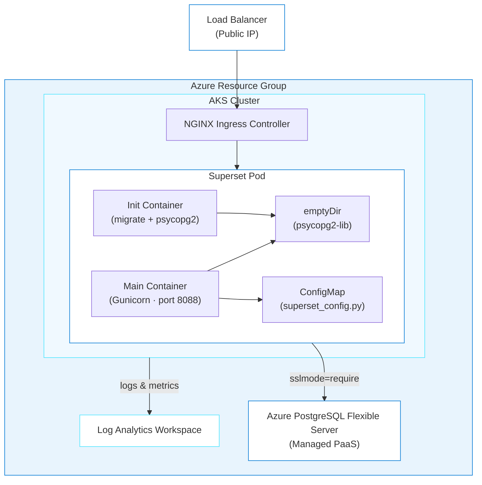

# Apache Superset on Azure Kubernetes Service

> ✨ **When Container Apps isn't enough, you need Kubernetes. The agent knows when and why.**

<p align="center">
  
</p>

[Apache Superset](https://superset.apache.org/) needs init containers (containers that run before the main app starts, used for setup tasks like database migrations), shared volumes, and custom config mounting, all patterns that are natural in Kubernetes. The agent knows this and generates AKS infrastructure. You'll deploy a full BI platform and learn when Kubernetes is the right choice.

## Learning Objectives

- Understand when AKS is required instead of Container Apps
- Deploy Superset with init containers, shared volumes, and ConfigMap (a Kubernetes object that stores configuration files) mounting
- Install psycopg2-binary into a shared emptyDir (a temporary shared volume that both containers can access) for PostgreSQL connectivity
- Use `azure_deploy_plan` with `target=AKS` for Kubernetes deployment planning
- Debug AKS-specific issues: init container failures, CrashLoopBackOff (a Kubernetes state where a container keeps crashing and restarting), SQLite fallback

> ⏱️ **Estimated Time**: ~30 minutes
>
> 💰 **Estimated Cost**: ~$200-215/month (AKS nodes are the main cost, see [Cost Breakdown](#cost-breakdown)). Clean up with `azd down` when done!**
>
> 📋 **Prerequisites**: See [prerequisites](../../README.md#prerequisites) for standard installation links.
>
> **Additional prerequisites for this journey:**
> - [`kubectl`](https://kubernetes.io/docs/tasks/tools/): needed for AKS cluster management

---

## Architecture



**Azure resources created:**

- **Azure Kubernetes Service (AKS)**: Managed Kubernetes cluster (2x Standard_D2s_v3 nodes)
- **Azure Database for PostgreSQL Flexible Server**: Managed database (required)
- **Azure Load Balancer**: Public IP for external access
- **NGINX Ingress Controller**: HTTP routing within the cluster
- **Azure Log Analytics**: Monitoring and diagnostics

**Infrastructure directory:** [`infra-superset/`](../../infra-superset/) (generated at repo root during deployment)

### Why AKS Instead of Container Apps?

Superset requires:
- **Init containers** for database migrations and psycopg2 installation
- **Shared volumes** (emptyDir) between init and main containers
- **ConfigMap mounting** for `superset_config.py`
- **More control** over the deployment lifecycle

These patterns are natural in Kubernetes but complex or unavailable in Container Apps.

> **Where does NGINX come from?** The post-provision hook installs the NGINX Ingress Controller into the cluster using Helm (a package manager for Kubernetes). It provides HTTP routing and a public Load Balancer IP for external access.

---

## Deploy with the Agent

You'll use `@oss-to-azure-deployer` in GitHub Copilot CLI to generate and deploy the entire infrastructure through conversation.

> **💡 Tip: Track issues as you go.** When giving Copilot CLI a prompt, add *"If you encounter any issues, log them to issues.md so they can be tracked and fixed."* This gives Copilot CLI a place to record problems it finds or fixes during generation, making it easier to iterate and debug.

### Step 1: Setup

Make sure you're in the repo root first:

```bash
cd github-azure-agentic-journeys
```

Then start Copilot CLI:

```bash
copilot
```

Once inside the interactive session, add the marketplace (first time only):

> **Note:** Lines starting with `>` in the code blocks below show what to type in the Copilot CLI session. Don't include the `>` character itself.

```
> /plugin marketplace add microsoft/azure-skills
```

Then install the plugin:

```
> /plugin install azure@azure-skills
```

> **Already installed?** The plugin persists across sessions. If you've done a previous journey, skip the install commands.
> For more details, see the [azure-skills repository](https://github.com/microsoft/azure-skills).

Now select the deployment agent:

```
> /agent
```

Select **`oss-to-azure-deployer`** from the list. You're now in an interactive session with the deployment agent.

### Step 2: Deploy

<p align="center">
  
</p>

Tell the agent what you want in a single prompt:

```
> Deploy Apache Superset to Azure using Bicep and azd. Set the location to westus, generate secure passwords for all credentials, and resolve any issues that come up.
```

The agent handles the entire deployment:

1. Loads the right skills (`superset-azure`, `azure-aks-deployment`, `azure-bicep-generation`, `azd-deployment`)
2. Recommends AKS over Container Apps because it knows Superset needs init containers, shared volumes, and ConfigMap mounting
3. Generates Bicep (Azure's infrastructure-as-code language) + Kubernetes infrastructure in `infra-superset/`
4. Updates `azure.yaml`, registers Azure providers, sets environment variables
5. Runs `azd up`
6. Runs post-provision hooks (`kubectl apply` for Kubernetes manifests, waits for external IP)

> ⏳ **While you wait:** This deployment can take awhile. AKS cluster creation alone takes several minutes. Put the time to good use:
>
> 1. Watch your resources appear in real-time. Open the [Azure Portal](https://portal.azure.com) → search for your resource group, or run `az resource list --resource-group rg-<env-name> --output table` in a separate terminal.
> 2. Read the [init container pattern](#psycopg2-installation-critical) above. Why can't you just `pip install psycopg2-binary` in the main container? (Hint: read-only filesystem.)
> 3. **Cost comparison:** This AKS deployment costs ~$200/month vs. ~$25 for n8n and ~$10 for Grafana. Open the [Cost Breakdown](#cost-breakdown) and think about when AKS is worth the premium. Always use the right tool for the right job.
> 4. Explore the [Superset demo gallery](https://superset.apache.org/gallery) to see what kinds of dashboards you can build after deployment.

You can ask follow-up questions anytime:

```
> Why do you need an init container for psycopg2?
> Why AKS instead of Container Apps?
```

### Step 3: Verify

Ask the agent to confirm everything is working:

```
> Verify the Superset deployment is working. Check that it's using PostgreSQL not SQLite.
```

You can also verify manually (open a new terminal or exit Copilot CLI with `Ctrl+C` first):

```bash
# Check pod status
kubectl get pods -n superset
# Expected output:
# NAME                        READY   STATUS    RESTARTS   AGE
# superset-xxxxxxxxx-xxxxx   1/1     Running   0          5m

# Verify PostgreSQL is being used (not SQLite)
POD=$(kubectl get pods -n superset -o jsonpath='{.items[0].metadata.name}')
kubectl logs -n superset $POD -c superset-init | grep -i "PostgresqlImpl"
# Expected output:
# INFO  [alembic.runtime.migration] Context impl PostgresqlImpl.

# Get the external URL
SUPERSET_URL=$(azd env get-value SUPERSET_URL)
curl -I "$SUPERSET_URL/health"
# Expected output:
# HTTP/1.1 200 OK
```

If the pod is stuck, just ask. You're still in the same session:

```
> My Superset pod is stuck in Init:0/1
```

### Step 4: Open Superset

Get your Superset URL and open it in the browser:

```bash
SUPERSET_URL=$(azd env get-value SUPERSET_URL)
echo "Open in browser: $SUPERSET_URL"
```

Log in with the username `admin` and the password you set during deployment (the `SUPERSET_ADMIN_PASSWORD` value). You should see the Superset home page with options to create charts and dashboards.

---

## Configuration Reference

<details>
<summary>Configuration Reference (handled by the agent automatically)</summary>

### Environment Variables

| Variable | Value | Description |
|----------|-------|-------------|
| `SQLALCHEMY_DATABASE_URI` | `postgresql://...?sslmode=require` | Full PostgreSQL connection string |
| `SUPERSET_SECRET_KEY` | (32+ char string) | Flask secret key for session signing |
| `SUPERSET_CONFIG_PATH` | `/app/pythonpath/superset_config.py` | Path to config file |
| `PYTHONPATH` | `/psycopg2-lib` | Include psycopg2 installation location |
| `ADMIN_USERNAME` | `admin` | Admin username |
| `ADMIN_PASSWORD` | (secret) | Admin password |
| `SUPERSET_WEBSERVER_PORT` | `8088` | Default Superset port |
| `GUNICORN_WORKERS` | `2` | Number of Gunicorn workers |
| `GUNICORN_TIMEOUT` | `120` | Request timeout in seconds |

**Critical:** Azure PostgreSQL requires `?sslmode=require` in the connection string.

### superset_config.py (Required)

⚠️ **Superset does NOT read environment variables directly for database configuration.** You must create a `superset_config.py` that bridges env vars to Superset's config:

```python
import os

SQLALCHEMY_DATABASE_URI = os.environ.get(
    'SQLALCHEMY_DATABASE_URI',
    'sqlite:////app/superset_home/superset.db'
)
SECRET_KEY = os.environ.get('SUPERSET_SECRET_KEY', 'change-me')

WTF_CSRF_ENABLED = True
WTF_CSRF_EXEMPT_LIST = []
WTF_CSRF_TIME_LIMIT = 60 * 60 * 24 * 365  # 1 year, extended for long dashboard sessions

FEATURE_FLAGS = {
    "DASHBOARD_NATIVE_FILTERS": True,
    "DASHBOARD_CROSS_FILTERS": True,
    "ENABLE_TEMPLATE_PROCESSING": True,
}
```

This is deployed as a Kubernetes ConfigMap mounted at `/app/pythonpath/`.

### psycopg2 Installation (Critical)

The official `apache/superset:latest` image **does NOT include psycopg2** for PostgreSQL. Without it, Superset silently falls back to SQLite.

**Solution:** Install to an emptyDir volume shared between init and main containers:

```yaml
volumes:
- name: psycopg2-install
  emptyDir: {}

initContainers:
- name: superset-init
  command: ["/bin/sh", "-c"]
  args:
    - |
      pip install psycopg2-binary --target=/psycopg2-lib
      PYTHONPATH=/psycopg2-lib superset db upgrade
      PYTHONPATH=/psycopg2-lib superset fab create-admin ... || true
      PYTHONPATH=/psycopg2-lib superset init
  volumeMounts:
  - name: psycopg2-install
    mountPath: /psycopg2-lib

containers:
- name: superset
  env:
  - name: PYTHONPATH
    value: "/psycopg2-lib"
  volumeMounts:
  - name: psycopg2-install
    mountPath: /psycopg2-lib
```

### Container Resources

| Component | CPU Request | CPU Limit | Memory Request | Memory Limit |
|-----------|-------------|-----------|----------------|--------------|
| Superset Web | 250m | 1000m | 512Mi | 2Gi |
| Init Container | 100m | 500m | 256Mi | 1Gi |

### Health Probes

Superset takes **60-90+ seconds** to start due to database migrations and Flask initialization.

| Probe | Initial Delay | Period | Failure Threshold | Max Wait |
|-------|---------------|--------|-------------------|----------|
| Startup | n/a | 10s | 60 | 10 minutes |
| Liveness | 90s | 15s | 5 | n/a |
| Readiness | 45s | 10s | 5 | n/a |

Health endpoint: `GET /health` → `{"status": "OK"}` (HTTP 200)

</details>

---

## Cost Breakdown

| Resource | SKU | Monthly Cost |
|----------|-----|--------------|
| AKS Cluster | 2x Standard_D2s_v3 | ~$170 |
| PostgreSQL Flexible Server | B_Standard_B1ms | ~$15 |
| Load Balancer | Standard | ~$20 |
| **Total** | | **~$200-215/month** |

⚠️ **Superset on AKS is significantly more expensive** than the Container Apps deployments (n8n ~$25-35, Grafana ~$10-20). Consider Container Apps if AKS features aren't required. Each Standard_D2s_v3 node costs ~$70/month ($0.096/hr × 730 hrs).

---

## Troubleshooting

### Deployment Failed (`azd up` errors)

**Common causes:**
1. **Provider not registered**: Run `az provider register --namespace Microsoft.ContainerService` and retry
2. **Subscription quota exceeded**: Check your VM quota with `az vm list-usage --location <region>`. AKS needs at least 4 vCPUs.
3. **Region capacity**: Try a different region if you see capacity errors

### ModuleNotFoundError: No module named 'psycopg2'

**Also appears as:** `Context impl SQLiteImpl` in logs (should be `PostgresqlImpl`).

**Cause:** psycopg2-binary not installed or not in PYTHONPATH.

**Fix:** Install with `pip install psycopg2-binary --target=/psycopg2-lib` and set `PYTHONPATH=/psycopg2-lib` in **both** init and main containers.

Ask the agent to diagnose:

```
> Superset logs show SQLiteImpl instead of PostgresqlImpl. Is psycopg2 installed correctly?
```

The agent knows this means psycopg2 isn't installed or PYTHONPATH isn't set, and will check both containers.

### SQLALCHEMY_DATABASE_URI Not Recognized

**Symptom:** Superset uses SQLite even though the env var is set.

**Cause:** Superset doesn't read env vars directly. It needs `superset_config.py`.

**Fix:** Create a ConfigMap with `superset_config.py` that reads `os.environ.get('SQLALCHEMY_DATABASE_URI')`, mount it, and set `SUPERSET_CONFIG_PATH`.

### Pod Stuck in Init:0/1

**Possible causes:**
1. PostgreSQL not reachable: check firewall rules
2. Wrong credentials: verify connection string
3. psycopg2 not installed: see above

Ask the agent to diagnose:

```
> My Superset pod is stuck in Init:0/1. Check the init container logs and test PostgreSQL connectivity.
```

### "'tcp' is not a valid port number"

**Misleading error.** Actually caused by psycopg2 not being installed. See the psycopg2 fix above.

### Permission Denied During pip install

**Cause:** The Superset container runs as non-root with read-only virtualenv.

**Writable locations:** `/psycopg2-lib` (emptyDir), `/tmp`, `/app/superset_home/.local/`

**Fix:** Always use `pip install --target=/psycopg2-lib` with an emptyDir volume.

### 500 Internal Server Error

**Check:**

Ask the agent:

```
> Superset is returning 500 errors. Check the main container logs and look for database connection or migration issues.
```

### Secret Key Error

**Symptom:** `SUPERSET_SECRET_KEY must be a non-empty string`

**Fix:** Ensure `SUPERSET_SECRET_KEY` is set in Kubernetes secrets (32+ characters).

---

## Cleanup

```bash
azd down --force --purge
```

Teardown takes 5-10 minutes (AKS + PostgreSQL deletion is slow).

---

## Key Learnings

- **The agent knows when to use AKS.** It recommends Kubernetes when Container Apps can't handle init containers, shared volumes, or ConfigMap mounting.
- **emptyDir volumes share data between init and main containers.** This is the pattern for installing runtime dependencies.
- **"SQLiteImpl" in logs means misconfiguration.** If you see this, the PostgreSQL connection string isn't reaching Superset.

---

## Assignment

1. Verify that Superset is using PostgreSQL, not SQLite. Ask the agent: *"Is my Superset deployment using PostgreSQL?"*
2. Compare the three deployments: Grafana (~$10-20, 2 min), n8n (~$25-35, 7 min), Superset (~$200-215, 15-20 min). When would you choose each?
3. Clean up with `azd down --force --purge`

---

## What's Next

You've completed the OSS deployment journeys. Here's where to go from here:

- **Ask the agent**: Start a session with `@oss-to-azure-deployer` and ask *"How would I deploy Gitea to Azure?"*
- **Contribute**: Found a bug or want to add an app? [Open an issue](https://github.com/DanWahlin/github-azure-agentic-journeys/issues)

> 📚 **See all agentic journeys:** [Back to overview](../../README.md#agentic-journeys)

---

## Resources

- [Apache Superset Documentation](https://superset.apache.org/docs/intro)
- [Azure Kubernetes Service](https://learn.microsoft.com/azure/aks/)
- [Azure Database for PostgreSQL](https://learn.microsoft.com/azure/postgresql/)
- [Azure Developer CLI](https://learn.microsoft.com/azure/developer/azure-developer-cli/)
